# noonnu-fonts

눈누(https://noonnu.cc) 폰트들을 npm 패키지로 제공합니다.

## 유의사항

-   이 프로젝트는 눈누에서 제공하는 폰트들을 npm 패키지로 게시하기 위한 것이며, 눈누와는 별개의 프로젝트입니다.
-   패키지가 스크립트로 자동 생성되기 때문에, 일부 패키지들은 정상적으로 동작하지 않을 수 있습니다.
-   눈누에서 게시가 중단된 폰트들은 npm에서 제거될 수 있습니다.
-   폰트 사용에 대한 책임은 전적으로 사용자에게 있습니다. (각 폰트의 라이센스를 꼭 확인해주세요.)

## 폰트 목록

| no  | 이름                        | 예제                                                                                                                                                                |
| --- | --------------------------- | ------------------------------------------------------------------------------------------------------------------------------------------------------------------- |
| 1   | 116앵무부리                 | <a href="./packages/116angmuburi/README.md">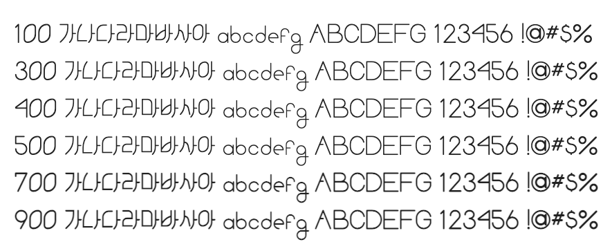</a>                                                         |
| 2   | 116수박화체                 | <a href="./packages/116watermelon/README.md">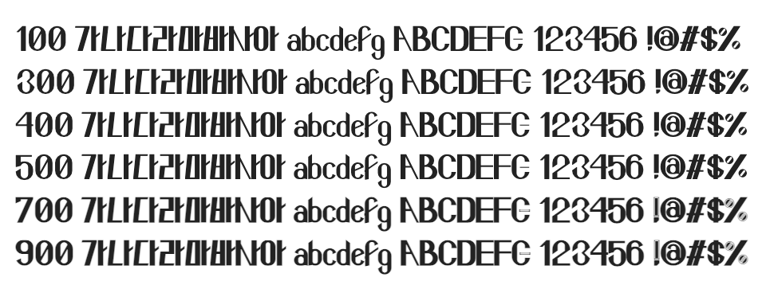</a>                                                       |
| 3   | 123RF                       | <a href="./packages/123-rf/README.md">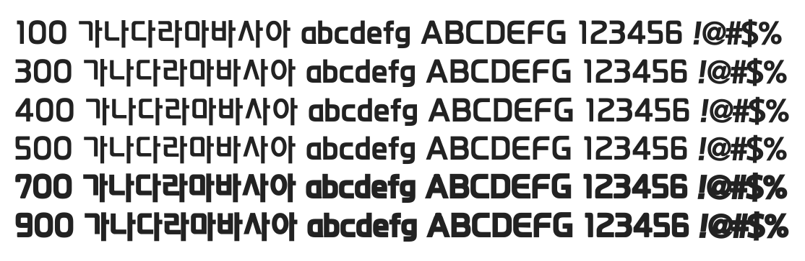</a>                                                                     |
| 4   | 1973미미월드                | <a href="./packages/1973-mimi-world-r/README.md">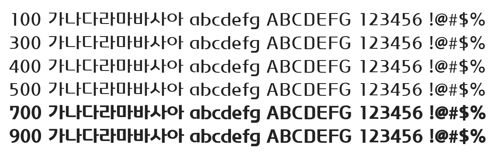</a>                                               |
| 5   | 양평군체                    | <a href="./packages/3-yang-pyeong-b/README.md">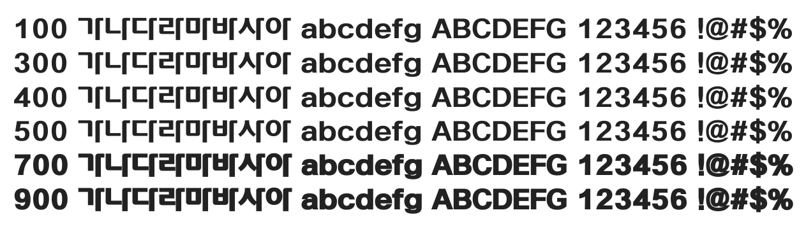</a>                                                   |
| 6   | 62570체                     | <a href="./packages/62570che/README.md">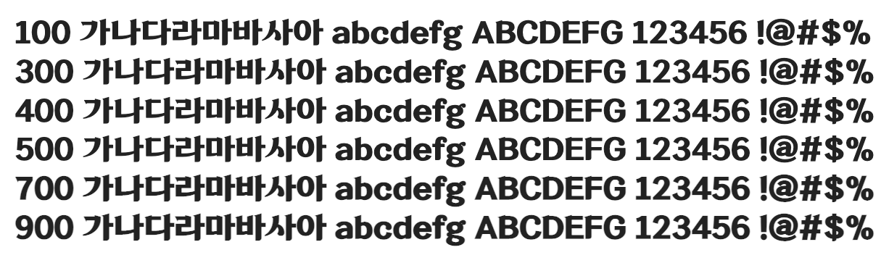</a>                                                                 |
| 7   | 봉숭아틴트                  | <a href="./packages/777-balsamtint/README.md">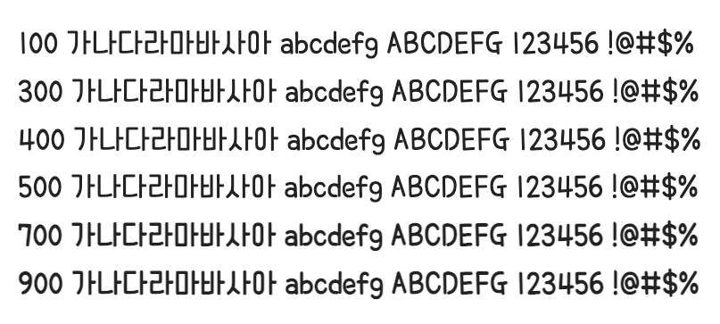</a>                                                     |
| 8   | 챠오츄르                    | <a href="./packages/777-chyaochyureu/README.md">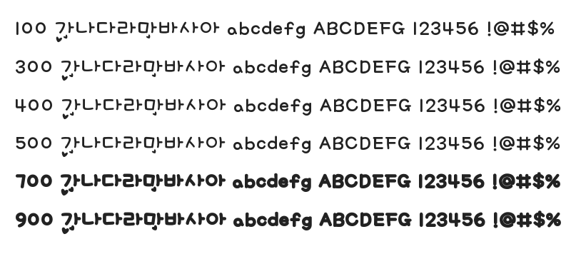</a>                                                 |
| 9   | 플라워                      | <a href="./packages/777-flower/README.md">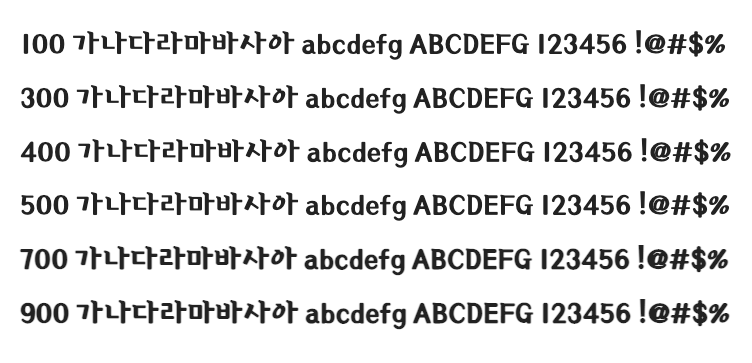</a>                                                             |
| 10  | 꽃보다곰팅                  | <a href="./packages/777-flowerbear/README.md">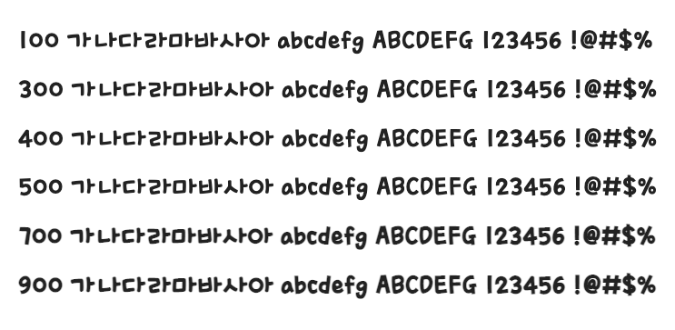</a>                                                     |
| 11  | 꼬마나비                    | <a href="./packages/777-kidbutterfly/README.md">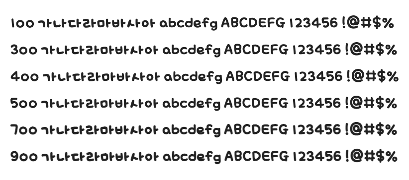</a>                                                 |
| 12  | 리틀베어                    | <a href="./packages/777-littlebear/README.md">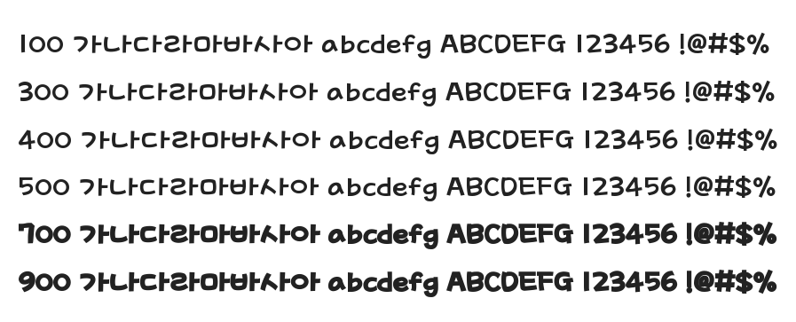</a>                                                     |
| 13  | 봄이조아                    | <a href="./packages/777-lovespring/README.md">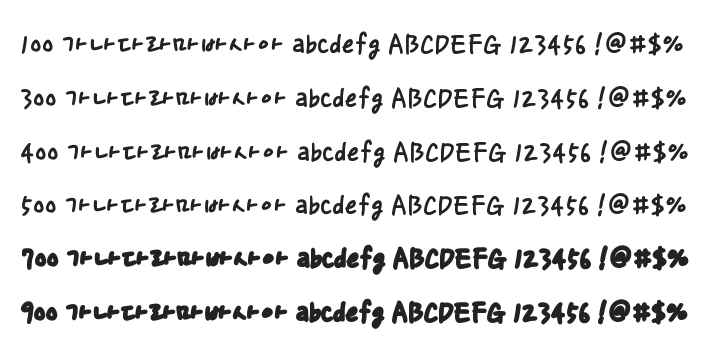</a>                                                     |
| 14  | 미니콩다방                  | <a href="./packages/777-minibeancafe/README.md">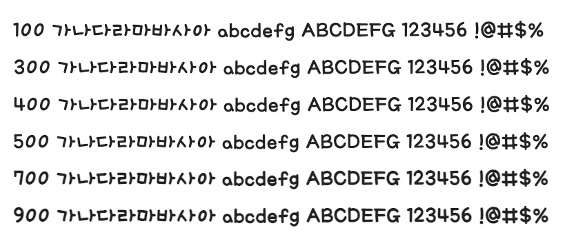</a>                                                 |
| 15  | 뉴욕커                      | <a href="./packages/777-newyorkers/README.md">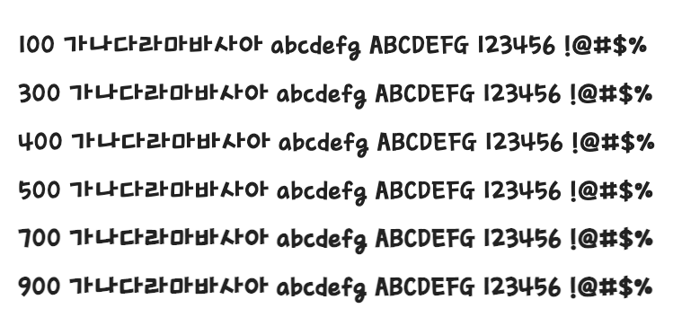</a>                                                     |
| 16  | 빨간우체통                  | <a href="./packages/777-redpostbox/README.md">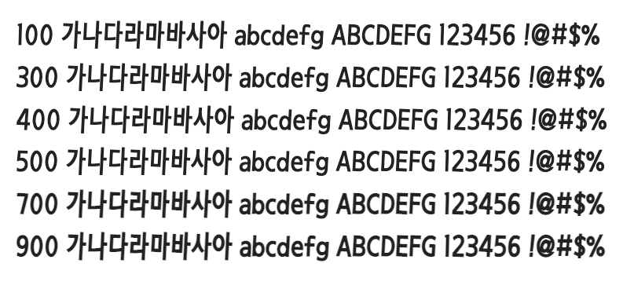</a>                                                     |
| 17  | 별나라달님                  | <a href="./packages/777-starlandmoon/README.md">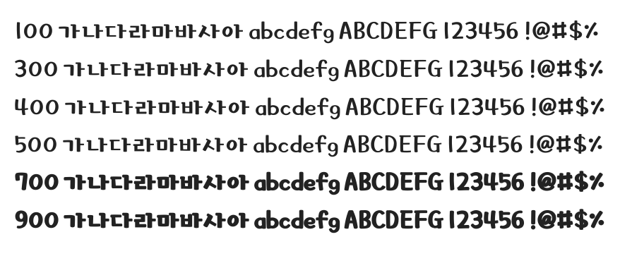</a>                                                 |
| 18  | 팔칠엠엠 일상 기울임        | <a href="./packages/87-mmilsang-oblique/README.md">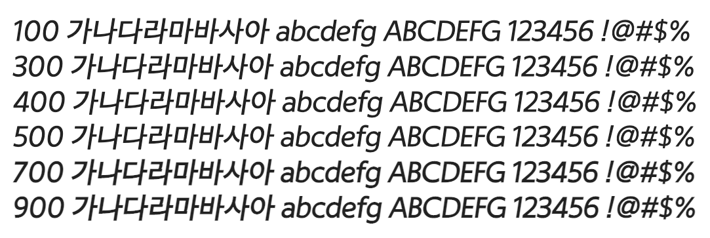</a>                                           |
| 19  | 팔칠엠엠 일상 보통          |                                            |
| 20  | ACC 어린이 하늘맑은체       | <a href="./packages/ac-cchildrenfall/README.md">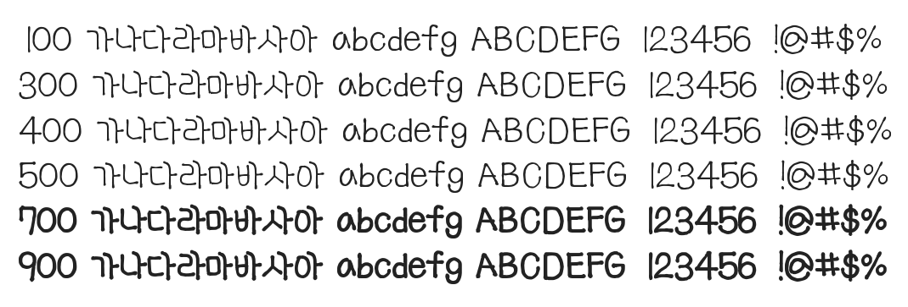</a>                                                 |
| 21  | ACC 어린이 마음고운체       |                        |
| 22  | ACC 어린이 가을담은체       | <a href="./packages/ac-cchildrensky/README.md">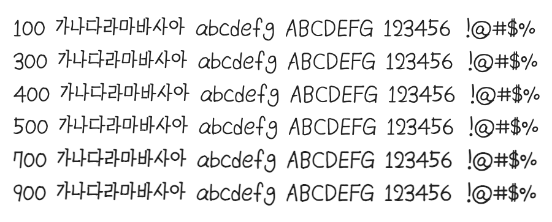</a>                                                   |
| 23  | 아도바 온리체               | <a href="./packages/adobaonly-r/README.md">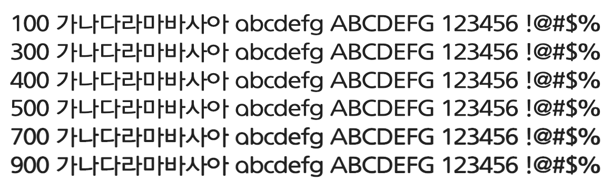</a>                                                           |
| 24  | 아인맘 손글씨               |                                                                      |
| 25  | 암스테르담                  | <a href="./packages/amsterdam/README.md">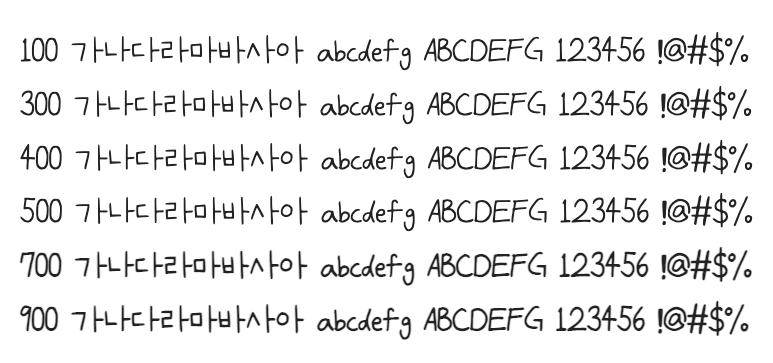</a>                                                               |
| 26  | 안쌍체                      | <a href="./packages/anssang/README.md">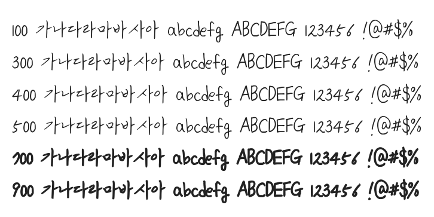</a>                                                                   |
| 27  | 안성탕면체                  | <a href="./packages/ansungtangmyun-bold/README.md">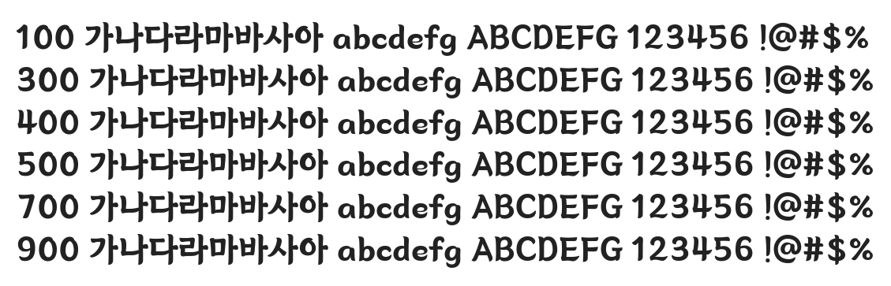</a>                                           |
| 28  | 안성탕면 ESG에코체          | <a href="./packages/ansungtangmyun-esg/README.md">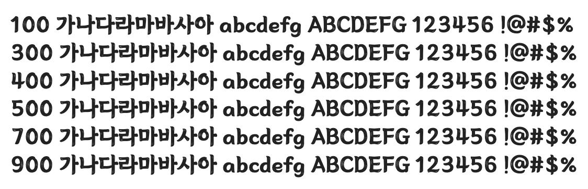</a>                                             |
| 29  | 아리따부리                  | <a href="./packages/arita-buri-semi-bold/README.md">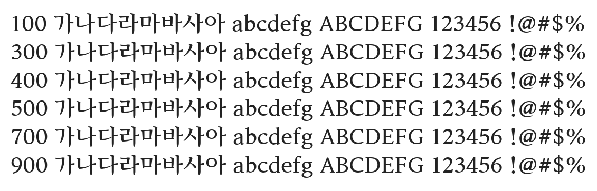</a>                                         |
| 30  | 아리따돋움                  | <a href="./packages/arita-dotum-medium/README.md">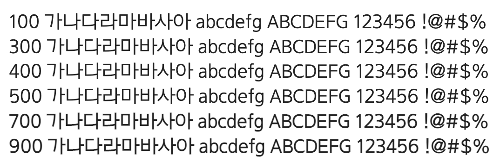</a>                                             |
| 31  | 애터미체                    | <a href="./packages/atomy-bold/README.md">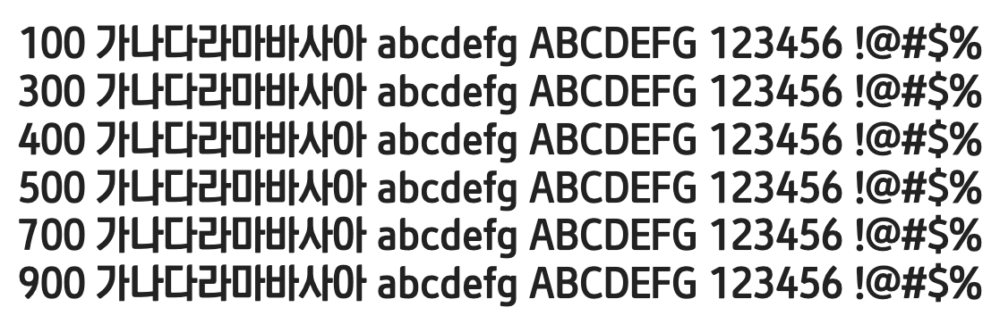</a>                                                             |
| 32  | 비씨카드 글꼴               | <a href="./packages/b-ccard-b/README.md">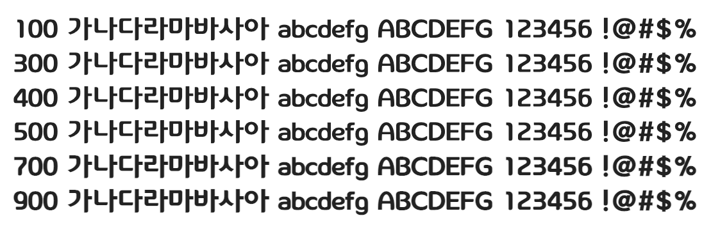</a>                                                               |
| 33  | 아기사랑체                  | <a href="./packages/baby-love/README.md">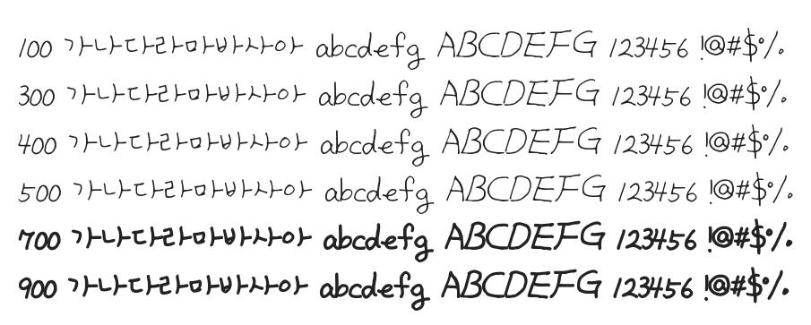</a>                                                               |
| 34  | 바른바탕체                  | <a href="./packages/bareun-batang/README.md">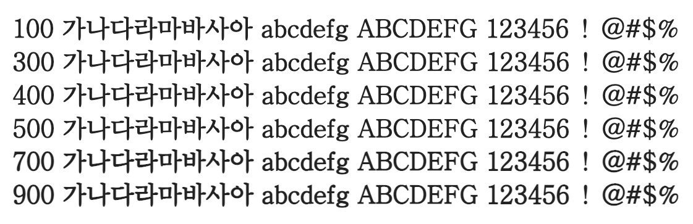</a>                                                       |
| 35  | 바른돋움체                  | <a href="./packages/bareun-dotum/README.md">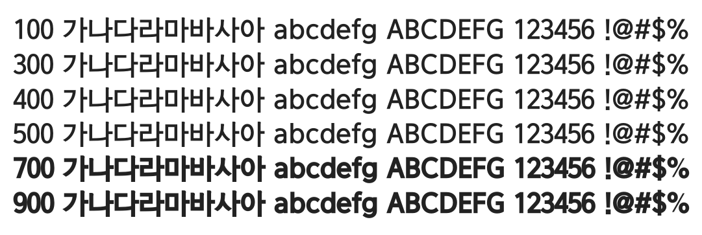</a>                                                         |
| 36  | 바른히피                    | <a href="./packages/bareun-hipi/README.md">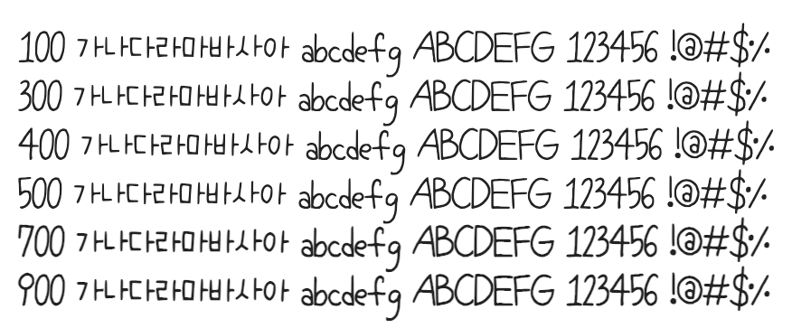</a>                                                           |
| 37  | 바른정신                    | <a href="./packages/bareun-mental/README.md">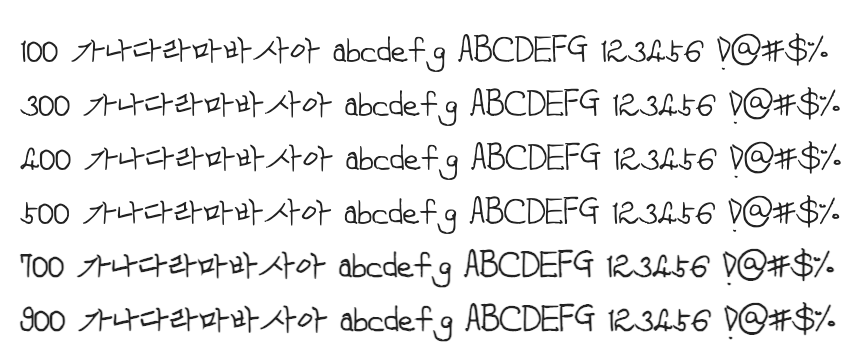</a>                                                       |
| 38  | 넥슨 배찌체                 | <a href="./packages/bazzi/README.md">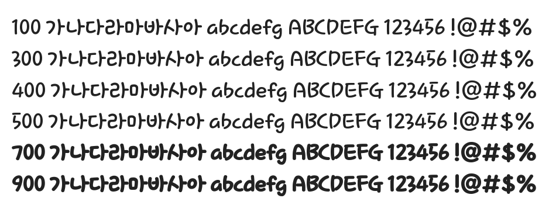</a>                                                                       |
| 39  | 유토이미지손글씨            | <a href="./packages/bb-tree-cb/README.md">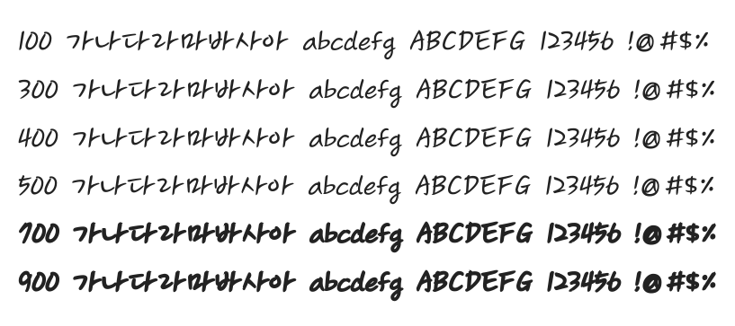</a>                                                             |
| 40  | 유토이미지손글씨R           | <a href="./packages/bb-tree-cr/README.md">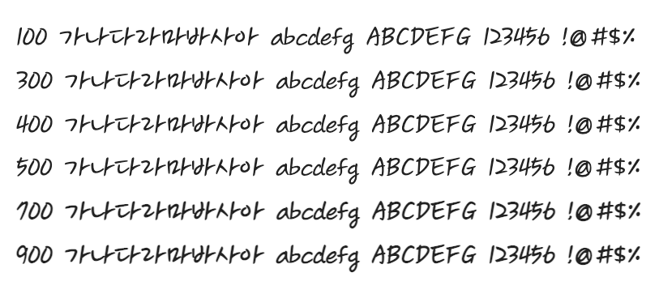</a>                                                             |
| 41  | 유토이미지고딕              | <a href="./packages/bb-tree-gb/README.md">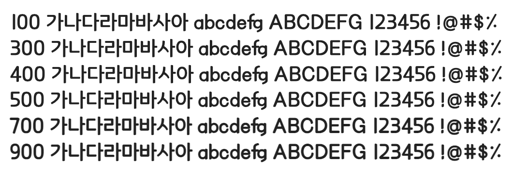</a>                                                             |
| 42  | 유토이미지나무              | <a href="./packages/bb-tree-tl/README.md">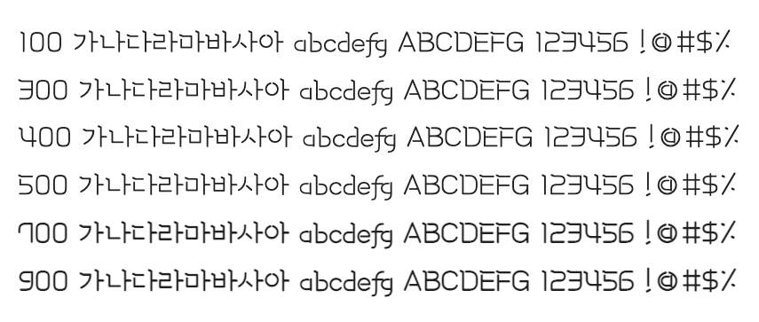</a>                                                             |
| 43  | 빵구니맘 손글씨             |                                                        |
| 44  | 야채장수 백금례             | <a href="./packages/beakeumrye/README.md">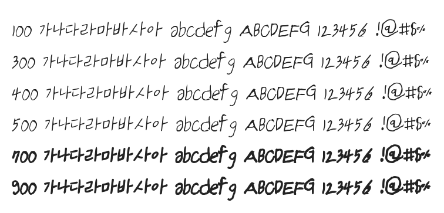</a>                                                             |
| 45  | 빈폴체                      | <a href="./packages/beanpoleot-m00/README.md">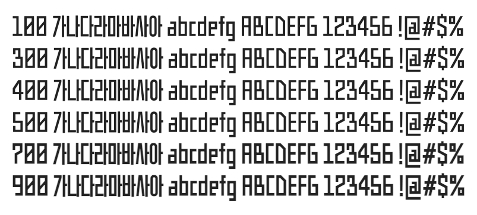</a>                                                     |
| 46  | 하나되어 손글씨             | <a href="./packages/become-one/README.md">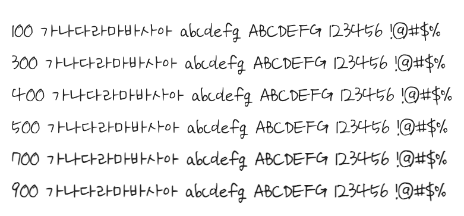</a>                                                             |
| 47  | 배은혜체                    |                                                                  |
| 48  | 법정체                      | <a href="./packages/beopjeong/README.md">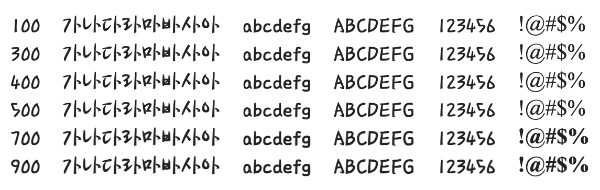</a>                                                               |
| 49  | 빙그레체                    | <a href="./packages/binggrae/README.md">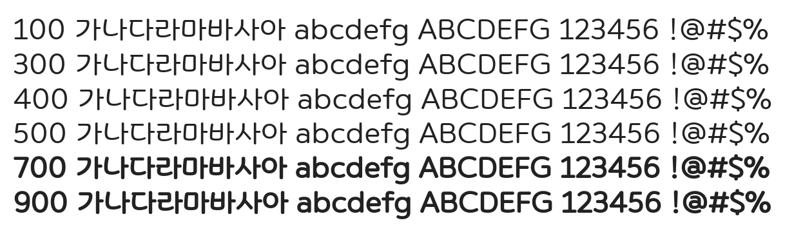</a>                                                                 |
| 50  | 빙그레 메로나체             | <a href="./packages/binggrae-melona-bold/README.md">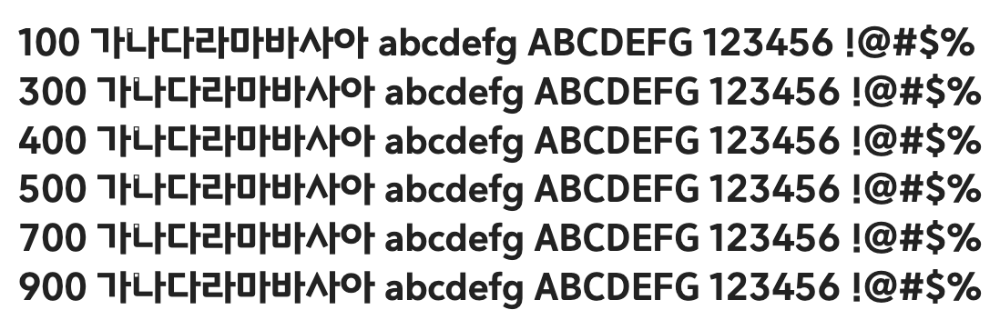</a>                                         |
| 51  | 빙그레 싸만코체             | <a href="./packages/binggrae-samanco-bold/README.md">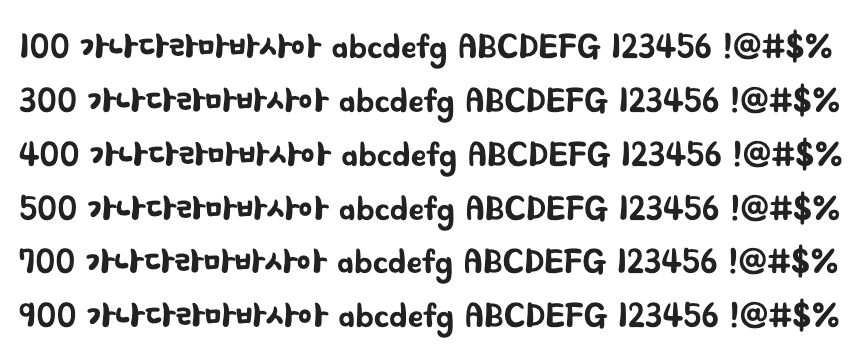</a>                                       |
| 52  | 빙그레체II                  | <a href="./packages/binggrae-two/README.md">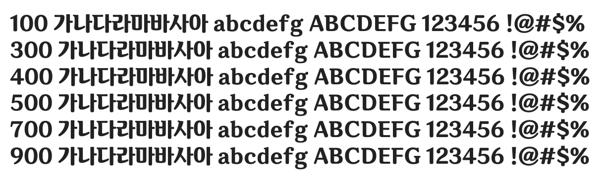</a>                                                         |
| 53  | 비상체                      | <a href="./packages/bisang/README.md">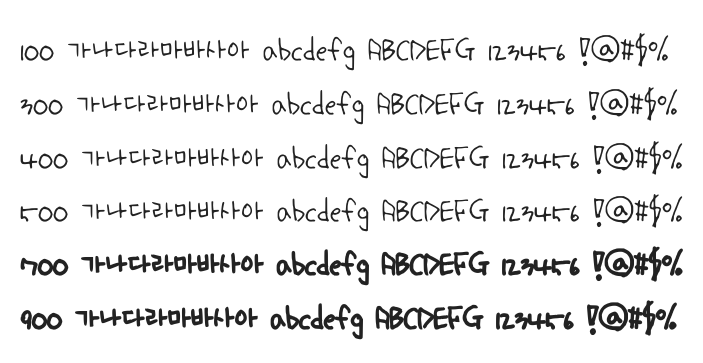</a>                                                                     |
| 54  | 던파 비트비트체             | <a href="./packages/bitbit/README.md">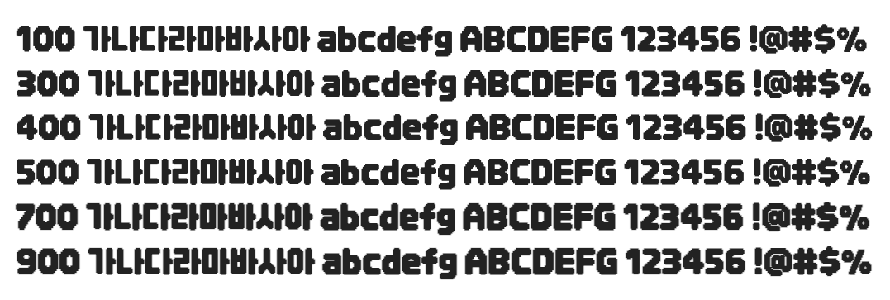</a>                                                                     |
| 55  | 빛고을광주체                | <a href="./packages/bitgoeul-bold/README.md">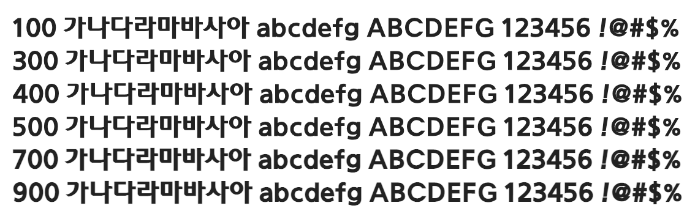</a>                                                       |
| 56  | 검은고딕                    | <a href="./packages/black-han-sans/README.md"></a>                                                     |
| 57  | 을지로10년후체              | <a href="./packages/bm-euljiro10yearslater/README.md"></a>                                     |
| 58  | 을지로오래오래체            | <a href="./packages/bm-euljirooraeorae/README.md"></a>                                             |
| 59  | 도현체                      | <a href="./packages/bmdohyeon/README.md"></a>                                                               |
| 60  | 을지로체                    | <a href="./packages/bmeuljiro/README.md"></a>                                                               |
| 61  | 한나체 Air                  | <a href="./packages/bmhanna-air/README.md"></a>                                                           |
| 62  | 한나체Pro                   | <a href="./packages/bmhanna-pro/README.md"></a>                                                           |
| 63  | 주아체                      | <a href="./packages/bmjua/README.md"></a>                                                                       |
| 64  | 기랑해랑체                  | <a href="./packages/bmkiranghaerang/README.md"></a>                                                   |
| 65  | 연성체                      | <a href="./packages/bmyeonsung/README.md"></a>                                                             |
| 66  | 온글잎 보현체               | <a href="./packages/bohyun/README.md"></a>                                                                     |
| 67  | 배스킨라빈스                | <a href="./packages/brba-b/README.md"></a>                                                                     |
| 68  | 밝은체                      | <a href="./packages/bright/README.md"></a>                                                                     |
| 69  | 버드나무                    | <a href="./packages/bud-tree/README.md"></a>                                                                 |
| 70  | 부장님 눈치체               | <a href="./packages/bujangnim-nunchi/README.md"></a>                                                 |
| 71  | 범솜체                      |                                                                      |
| 72  | 부산체                      | <a href="./packages/busan/README.md"></a>                                                                       |
| 73  | 부산바다체                  | <a href="./packages/busan-bada/README.md"></a>                                                             |
| 74  | 카페24 클래식타입           | <a href="./packages/cafe24-classic-type-regular/README.md"></a>                           |
| 75  | 카페24 당당해               | <a href="./packages/cafe24-dangdanghae/README.md"></a>                                             |
| 76  | 카페24 단정해               | <a href="./packages/cafe24-danjunghae/README.md"></a>                                               |
| 77  | 카페24 동동                 |                                                    |
| 78  | 카페24 아네모네             |                                                    |
| 79  | 카페24 아네모네 에어        | <a href="./packages/cafe24-ohsquareair/README.md"></a>                                             |
| 80  | 카페24 고운밤               | <a href="./packages/cafe24-oneprettynight/README.md"></a>                                       |
| 81  | 카페24 빛나는별             | <a href="./packages/cafe24-shiningstar/README.md"></a>                                             |
| 82  | 카페24 심플해               | <a href="./packages/cafe24-simplehae/README.md"></a>                                                 |
| 83  | 카페24 쑥쑥                 | <a href="./packages/cafe24-ssukssuk/README.md"></a>                                                   |
| 84  | 카페24 써라운드             | <a href="./packages/cafe24-ssurround/README.md"></a>                                                 |
| 85  | 카페24 써라운드에어         | <a href="./packages/cafe24-ssurround-air/README.md"></a>                                         |
| 86  | 카페24 숑숑                 | <a href="./packages/cafe24-syongsyong/README.md"></a>                                               |
| 87  | 충북대직지체                | <a href="./packages/cbnujikji/README.md"></a>                                                               |
| 88  | 칠곡할매 추유을체           | <a href="./packages/chilgok-cye/README.md"></a>                                                           |
| 89  | 칠곡할매 권안자체           | <a href="./packages/chilgok-kaj/README.md"></a>                                                           |
| 90  | 칠곡할매 김영분체           | <a href="./packages/chilgok-kyb/README.md"></a>                                                           |
| 91  | 칠곡할매 이종희체           | <a href="./packages/chilgok-ljh/README.md"></a>                                                           |
| 92  | 칠곡할매 이원순체           | <a href="./packages/chilgok-lws/README.md"></a>                                                           |
| 93  | 초딩희망                    | <a href="./packages/choding-hope/README.md"></a>                                                         |
| 94  | 전라북도체                  | <a href="./packages/chonbukl/README.md"></a>                                                                 |
| 95  | 조선견고딕                  |                                                                |
| 96  | 조선100년체                 | <a href="./packages/chosun-centennial/README.md"></a>                                               |
| 97  | 조선궁서체                  | <a href="./packages/chosun-gs/README.md"></a>                                                               |
| 98  | 조선굴림체                  | <a href="./packages/chosun-gu/README.md"></a>                                                               |
| 99  | 조선굵은고딕                | <a href="./packages/chosun-kg/README.md"></a>                                                               |
| 100 | 조선굵은명조                | <a href="./packages/chosun-km/README.md"></a>                                                               |
| 101 | 조선로고체                  | <a href="./packages/chosun-lo/README.md"></a>                                                               |
| 102 | 조선가는고딕                | <a href="./packages/chosun-sg/README.md"></a>                                                               |
| 103 | 조선신명조                  | <a href="./packages/chosun-sm/README.md"></a>                                                               |
| 104 | 조선일보명조체              | <a href="./packages/chosunilbo-myungjo/README.md"></a>                                             |
| 105 | 철필글씨                    | <a href="./packages/chulpil-writing/README.md"></a>                                                   |
| 106 | 충북대70주년체              | <a href="./packages/chungbuk-national-university-regular/README.md"></a>         |
| 107 | 추사 사랑체                 |                                                              |
| 108 | 코코체                      | <a href="./packages/coco/README.md"></a>                                                                         |
| 109 | 쿠키런                      |                                              |
| 110 | 시우 귀여워                 | <a href="./packages/cute-siu/README.md"></a>                                                                 |
| 111 | 창원단감아삭체              | <a href="./packages/cw-dangam-asac-bold/README.md"></a>                                           |
| 112 | D2Coding                    | <a href="./packages/d2-coding/README.md"></a>                                                               |
| 113 | 다채사랑                    | <a href="./packages/dache-love/README.md"></a>                                                             |
| 114 | 대한체                      | <a href="./packages/daehan-bold/README.md"></a>                                                           |
| 115 | 다행체                      | <a href="./packages/daheng/README.md"></a>                                                                     |
| 116 | 다진체                      | <a href="./packages/dajin/README.md"></a>                                                                       |
| 117 | 달무리                      | <a href="./packages/dalmoori/README.md"></a>                                                                 |
| 118 | 달서달링체                  | <a href="./packages/dalseo-darling/README.md"></a>                                                     |
| 119 | 달서힐링체                  | <a href="./packages/dalseo-healing-bold/README.md"></a>                                           |
| 120 | 우리딸 손글씨               | <a href="./packages/daughter-handwriting/README.md"></a>                                         |
| 121 | 따악단단                    | <a href="./packages/ddakdandan/README.md"></a>                                                             |
| 122 | 또박또박                    | <a href="./packages/ddobakddobak/README.md"></a>                                                         |
| 123 | 대광유리                    | <a href="./packages/deagwang-mirror/README.md"></a>                                                   |
| 124 | 덕온공주체                  | <a href="./packages/deogon-princess/README.md"></a>                                                   |
| 125 | 덕온공주옛체                | <a href="./packages/deogon-princess-classic/README.md"></a>                                   |
| 126 | 디자인하우스체              | <a href="./packages/designhouse-otf-light00/README.md"></a>                                   |
| 127 | 영양군 음식디미방체         | <a href="./packages/dimibang-new/README.md"></a>                                                         |
| 128 | 잘하고 있어                 | <a href="./packages/doing-well/README.md"></a>                                                             |
| 129 | 대한민국 독도체             | <a href="./packages/dokdo/README.md"></a>                                                                       |
| 130 | 독립체                      | <a href="./packages/dokrip/README.md"></a>                                                                     |
| 131 | 문화재돌봄체                | <a href="./packages/dolbomche-r/README.md"></a>                                                           |
| 132 | 동글                        | <a href="./packages/dongle-regular/README.md"></a>                                                     |
| 133 | 두넌체                      |                                                        |
| 134 | 도스고딕                    | <a href="./packages/dos-gothic/README.md"></a>                                                             |
| 135 | 도스한글                    | <a href="./packages/dos-kor/README.md"></a>                                                                   |
| 136 | 도스명조                    | <a href="./packages/dos-myungjo/README.md"></a>                                                           |
| 137 | 도스샘물                    | <a href="./packages/dos-saemmul/README.md"></a>                                                           |
| 138 | 도서관체                    | <a href="./packages/dosuguan/README.md"></a>                                                                 |
| 139 | 점꼴체                      | <a href="./packages/dot-font/README.md"></a>                                                                 |
| 140 | 둘기마요                    | <a href="./packages/dovemayo-medium/README.md"></a>                                                   |
| 141 | 다래손글씨체                | <a href="./packages/drfont-daraehand/README.md"></a>                                                 |
| 142 | 둥근모꼴+ Fixedsys          | <a href="./packages/dung-geun-mo/README.md"></a>                                                         |
| 143 | DW임팩타민체                | <a href="./packages/dw-impactamin/README.md"></a>                                                       |
| 144 | 다이어리체                  | <a href="./packages/early-font-diary/README.md"></a>                                                 |
| 145 | EBS훈민정음                 | <a href="./packages/ebs-hunminjeongeum-sba/README.md"></a>                                     |
| 146 | EBS훈민정음새론체           |                                                |
| 147 | EBS주시경체                 | <a href="./packages/ebsjsk-medium/README.md"></a>                                                       |
| 148 | A1 전용서체                 | <a href="./packages/ef-aone/README.md"></a>                                                                   |
| 149 | 척척고딕                    | <a href="./packages/ef-chuckchuck/README.md"></a>                                                       |
| 150 | 오이냉체                    | <a href="./packages/ef-cucumbersalad/README.md"></a>                                                 |
| 151 | 피렌체                      | <a href="./packages/ef-firenze/README.md"></a>                                                             |
| 152 | 혀니도로롱                  | <a href="./packages/ef-hyunydororong/README.md"></a>                                                 |
| 153 | 혀니고딕                    | <a href="./packages/ef-hyunygothic/README.md"></a>                                                     |
| 154 | 제주돌담체                  | <a href="./packages/ef-jejudoldam/README.md"></a>                                                       |
| 155 | 라디오고딕                  | <a href="./packages/ef-ladio/README.md"></a>                                                                 |
| 156 | 마초체                      | <a href="./packages/ef-macho/README.md"></a>                                                                 |
| 157 | 널리고딕                    | <a href="./packages/ef-nuly/README.md"></a>                                                                   |
| 158 | 레베카체                    | <a href="./packages/ef-rebecca/README.md"></a>                                                             |
| 159 | 정신차렷체                  | <a href="./packages/ef-wakeup/README.md"></a>                                                               |
| 160 | 수박화체                    | <a href="./packages/ef-watermelon-salad/README.md"></a>                                           |
| 161 | 유니폰트                    | <a href="./packages/ef-yoony/README.md"></a>                                                                 |
| 162 | 이랜드 초이스체             | <a href="./packages/eland-choice-m/README.md"></a>                                                     |
| 163 | 이랜드 나이스체             | <a href="./packages/eland-nice-m/README.md"></a>                                                         |
| 164 | 엘리스디지털배움체          | <a href="./packages/elice-digital-baeum-bd/README.md"></a>                                     |
| 165 | 엘리스 디지털코딩체         | <a href="./packages/elice-digital-baeum-bold/README.md"></a>                                 |
| 166 | 환경체                      | <a href="./packages/environment-r/README.md"></a>                                                       |
| 167 | 남양주다산                  | <a href="./packages/eoe-ye-b/README.md"></a>                                                                 |
| 168 | 남양주고딕                  | <a href="./packages/eoe-zno-eb/README.md"></a>                                                             |
| 169 | notcliche체 이현준          | <a href="./packages/establish-not-cliche-otf/README.md"></a>                                 |
| 170 | 설립체 유건욱               | <a href="./packages/establish-retrosans-otf/README.md"></a>                                   |
| 171 | 칠백삼체 유서연             | <a href="./packages/establish-room-no703-otf/README.md"></a>                                 |
| 172 | 가시가시체 백민주           | <a href="./packages/establish-thorn-font-otf/README.md"></a>                                 |
| 173 | 나는야핵인싸체 최서연       | <a href="./packages/establishnaneunyahaeginsa-otf/README.md"></a>                       |
| 174 | 을유1945                    | <a href="./packages/eulyoo1945-regular/README.md"></a>                                             |
| 175 | 동화또박                    | <a href="./packages/fairytale-ddobak/README.md"></a>                                                 |
| 176 | 아빠글씨                    | <a href="./packages/father-handwriting/README.md"></a>                                             |
| 177 | 아빠의 연애편지             | <a href="./packages/father-loveletter/README.md"></a>                                               |
| 178 | 효남 늘 화이팅              | <a href="./packages/fighting-hyonam/README.md"></a>                                                   |
| 179 | 소방관의 기도               | <a href="./packages/firefighter-prayer/README.md"></a>                                             |
| 180 | 꽃소금체                    |                                                            |
| 181 | 아름드리 꽃나무             | <a href="./packages/flower-tree/README.md"></a>                                                           |
| 182 | 안경잡이체                  | <a href="./packages/foureyes/README.md"></a>                                                                 |
| 183 | 펀플로생존자                | <a href="./packages/funflowsurvivorkr/README.md"></a>                                               |
| 184 | 미래나무                    | <a href="./packages/future-tree/README.md"></a>                                                           |
| 185 | 가비아 봄바람체             |                                                      |
| 186 | 가비아 청연체               | <a href="./packages/gabia-cheongyeon/README.md"></a>                                                 |
| 187 | 가비아 마음결체             | <a href="./packages/gabia-maeumgyeol/README.md"></a>                                                 |
| 188 | 가비아 솔미체               | <a href="./packages/gabia-solmee/README.md"></a>                                                         |
| 189 | 갈맷글                      | <a href="./packages/galmetgol/README.md"></a>                                                               |
| 190 | 갈무리11                    | <a href="./packages/galmuri11/README.md"></a>                                                               |
| 191 | 갈무리7                     | <a href="./packages/galmuri7/README.md"></a>                                                                 |
| 192 | 갈무리9                     | <a href="./packages/galmuri9/README.md"></a>                                                                 |
| 193 | 강원교육현옥샘체            | <a href="./packages/gangwon-edu-hyeonok-t-otf-medium-a/README.md"></a>             |
| 194 | 강원교육모두체              |                                      |
| 195 | 강원교육튼튼체              | <a href="./packages/gangwon-edu-power-extra-bold-a/README.md"></a>                     |
| 196 | 강원교육새음체              | <a href="./packages/gangwon-edu-saeeum-otf-medium-a/README.md"></a>                   |
| 197 | 가람연꽃                    | <a href="./packages/garam/README.md"></a>                                                                       |
| 198 | 김좌진장군체                | <a href="./packages/gen-k-jwajin-otf-rg/README.md"></a>                                           |
| 199 | 금은보화                    | <a href="./packages/geumeunbohwa/README.md"></a>                                                         |
| 200 | 끄트머리                    | <a href="./packages/ggeuteumuri/README.md"></a>                                                           |
| 201 | 가나초콜릿체                | <a href="./packages/ghanachoco/README.md"></a>                                                             |
| 202 | 기쁨밝음                    |                                                      |
| 203 | 길벗체 BI                   | <a href="./packages/gilbeot-bi/README.md"></a>                                                             |
| 204 | 길벗체 Rainbow              | <a href="./packages/gilbeot-rainbow/README.md"></a>                                                   |
| 205 | 길벗체 TG                   | <a href="./packages/gilbeot-tg/README.md"></a>                                                             |
| 206 | 김해가야체                  | <a href="./packages/gimhae-gaya-r/README.md"></a>                                                       |
| 207 | 김제시체                    | <a href="./packages/gimje/README.md"></a>                                                                       |
| 208 | 김포평화바탕                | <a href="./packages/gimpo-batang00/README.md"></a>                                                     |
| 209 | 김포평화고딕                | <a href="./packages/gimpo-gothic-regular00/README.md"></a>                                     |
| 210 | 김포평화제목                | <a href="./packages/gimpo-title00/README.md"></a>                                                       |
| 211 | 세계적인 한글               | <a href="./packages/global-hangul/README.md"></a>                                                       |
| 212 | Gmarket Sans                | <a href="./packages/gmarket-sans-medium/README.md"></a>                                           |
| 213 | 고도체                      | <a href="./packages/godo/README.md"></a>                                                                         |
| 214 | 고도마음체                  | <a href="./packages/godo-maum/README.md"></a>                                                               |
| 215 | 곰신체                      | <a href="./packages/gomsin/README.md"></a>                                                                     |
| 216 | 이사만루                    | <a href="./packages/gong-gothic-medium/README.md"></a>                                             |
| 217 | 좋은이웃체                  | <a href="./packages/good-neighbors-good-neighbors-bold/README.md"></a>             |
| 218 | 꽃내음                      |                                                              |
| 219 | 고산자                      |                                                                    |
| 220 | 고성금강누리체              | <a href="./packages/goseonggeumgangnuri/README.md"></a>                                           |
| 221 | Gothic A1                   | <a href="./packages/gothic-a1-light/README.md"></a>                                                   |
| 222 | 고딕 아니고 고딩            | <a href="./packages/gothic-goding/README.md"></a>                                                       |
| 223 | 고운바탕                    | <a href="./packages/gowun-batang-regular/README.md"></a>                                         |
| 224 | 고운돋움                    |                                            |
| 225 | 고양체                      | <a href="./packages/goyang/README.md"></a>                                                                     |
| 226 | 고양덕양체                  | <a href="./packages/goyang-deogyang/README.md"></a>                                                   |
| 227 | 고양일산체                  | <a href="./packages/goyang-ilsan/README.md"></a>                                                         |
| 228 | 외할머니글씨                | <a href="./packages/grandma-wring/README.md"></a>                                                       |
| 229 | 할아버지의나눔              |                                                    |
| 230 | 박물관문화재단클래식        | <a href="./packages/gukripbakmulgwanmunhwajaedankeulraesik-b/README.md"></a> |
| 231 | 경기천년바탕                | <a href="./packages/gyeonggi-batang/README.md"></a>                                                   |
| 232 | 경기천년제목                | <a href="./packages/gyeonggi-title-m/README.md"></a>                                                 |
| 233 | 온글잎 경영체               | <a href="./packages/gyungyoung/README.md"></a>                                                             |
| 234 | 해남체                      | <a href="./packages/haenam-font/README.md"></a>                                                           |
| 235 | 행복고흥                    | <a href="./packages/haengbokgoheung-l/README.md"></a>                                               |
| 236 | 함렛                        | <a href="./packages/hahmlet-regular/README.md"></a>                                                   |
| 237 | 한림고딕체                  | <a href="./packages/hallym-gothic-regular/README.md"></a>                                       |
| 238 | 한림명조체                  | <a href="./packages/hallym-mjo-regular/README.md"></a>                                             |
| 239 | 함초롬바탕체                | <a href="./packages/han-batang/README.md"></a>                                                             |
| 240 | 한용운체                    | <a href="./packages/han-yong-un/README.md"></a>                                                           |
| 241 | 하나손글씨                  | <a href="./packages/hana-handwriting/README.md"></a>                                                 |
| 242 | 한컴 울주 반구대 암각화체   | <a href="./packages/hancom-ulju-bangudae/README.md"></a>                                         |
| 243 | 한컴 울주 천전리 각석체     | <a href="./packages/hancom-ulju-cheonjeonri/README.md"></a>                                   |
| 244 | 손편지체                    | <a href="./packages/handletter/README.md"></a>                                                             |
| 245 | 한돈 삼겹살체               | <a href="./packages/handon3gyeopsal600g/README.md"></a>                                           |
| 246 | 한글누리체                  | <a href="./packages/hangeul-nuri-bold/README.md"></a>                                               |
| 247 | 한겨레결체                  | <a href="./packages/hankc/README.md"></a>                                                                       |
| 248 | 한나체                      | <a href="./packages/hanna/README.md"></a>                                                                       |
| 249 | 한윤체                      | <a href="./packages/hanyoon/README.md"></a>                                                                   |
| 250 | 해피니스 산스               | <a href="./packages/happiness-sans-bold/README.md"></a>                                           |
| 251 | 해피니스 산스 Title         | <a href="./packages/happiness-sans-title/README.md"></a>                                         |
| 252 | 행복한 도비                 | <a href="./packages/happy-dobi/README.md"></a>                                                             |
| 253 | 하람체                      | <a href="./packages/haram/README.md"></a>                                                                       |
| 254 | 열일체                      | <a href="./packages/hardworking/README.md"></a>                                                           |
| 255 | 노력하는 동희               | <a href="./packages/hardworking-donghee/README.md"></a>                                           |
| 256 | HBIOS-SYS                   | <a href="./packages/hbios-sys/README.md"></a>                                                               |
| 257 | 함초롬체                    | <a href="./packages/hcr-dotum/README.md"></a>                                                               |
| 258 | 헬스셋 조릿대체             | <a href="./packages/healthset-bamboo-std/README.md"></a>                                         |
| 259 | 헬스셋 고딕체               | <a href="./packages/healthset-gothic-light/README.md"></a>                                     |
| 260 | 빛의계승자체                | <a href="./packages/heirof-light-bold/README.md"></a>                                               |
| 261 | 그녀-길원옥                 |                                                          |
| 262 | 그녀-이옥선                 | <a href="./packages/her-leeoksun/README.md"></a>                                                         |
| 263 | 온글잎 해솜체               | <a href="./packages/hesom/README.md"></a>                                                                       |
| 264 | 횡성한우체                  | <a href="./packages/hoengseong-hanu/README.md"></a>                                                   |
| 265 | 희망누리                    | <a href="./packages/hope-nuri/README.md"></a>                                                               |
| 266 | HS봄바람체 2.0              | <a href="./packages/hs-bombaram/README.md"></a>                                                           |
| 267 | HS봄바람체 3.0              | <a href="./packages/hs-bombaram3-regular/README.md"></a>                                         |
| 268 | HS두꺼비체                  | <a href="./packages/hs-dookubi/README.md"></a>                                                             |
| 269 | HS가을생각체2.0             | <a href="./packages/hs-gaeul-senggak20/README.md"></a>                                             |
| 270 | HS가을생각체                | <a href="./packages/hs-gaeulsenggak/README.md"></a>                                                   |
| 271 | HS굴토끼체                  | <a href="./packages/hs-gooltokki/README.md"></a>                                                         |
| 272 | HS겨울눈꽃체2.0             | <a href="./packages/hs-gyeoul-noonkott20/README.md"></a>                                         |
| 273 | HS겨울눈꽃체                | <a href="./packages/hs-gyoulnoonkot/README.md"></a>                                                   |
| 274 | HS산토끼체                  | <a href="./packages/hs-regular/README.md"></a>                                                             |
| 275 | HS새마을체                  | <a href="./packages/hs-saemaul-regular/README.md"></a>                                             |
| 276 | HS여름물빛체                | <a href="./packages/hs-summer/README.md"></a>                                                               |
| 277 | HS유지체                    | <a href="./packages/hs-yuji-regular/README.md"></a>                                                   |
| 278 | 휴먼범석체                  | <a href="./packages/humanbumsuk/README.md"></a>                                                           |
| 279 | 혜준체                      | <a href="./packages/hyejun/README.md"></a>                                                                     |
| 280 | 혁이체                      | <a href="./packages/hyukee/README.md"></a>                                                                     |
| 281 | 나는 이겨낸다               | <a href="./packages/i-survive/README.md"></a>                                                               |
| 282 | IBM Plex Sans               | <a href="./packages/ibm-plex-sans-kr-regular/README.md"></a>                                 |
| 283 | IM혜민체                    | <a href="./packages/im-hyemin-bold/README.md"></a>                                                     |
| 284 | 아임크리수진체              | <a href="./packages/imcre-soojin/README.md"></a>                                                         |
| 285 | 독립기념관체                | <a href="./packages/independence-hall/README.md"></a>                                               |
| 286 | 인피니티산스                | <a href="./packages/infinity-sans-regular-a1/README.md"></a>                                 |
| 287 | 잉크립퀴드체                | <a href="./packages/ink-lipquid/README.md"></a>                                                           |
| 288 | 귀염발랄체                  | <a href="./packages/insungit-cutelivelyjisu/README.md"></a>                                   |
| 289 | 이롭게바탕체                | <a href="./packages/iropke-batang/README.md"></a>                                                       |
| 290 | J개구쟁이                   | <a href="./packages/j-gaegujaengyi-medium-ko/README.md"></a>                                 |
| 291 | J해바라기                   | <a href="./packages/j-haebaragi-medium-ko/README.md"></a>                                       |
| 292 | J송명                       | <a href="./packages/j-song-myung-regular-ko/README.md"></a>                                   |
| 293 | 한글재민체                  | <a href="./packages/jaemin/README.md"></a>                                                                     |
| 294 | 잘풀리는하루체              |                                                                  |
| 295 | 잘풀리는오늘체              | <a href="./packages/jal-onuel/README.md"></a>                                                               |
| 296 | 아줌마 자유                 | <a href="./packages/jayoo/README.md"></a>                                                                       |
| 297 | 제주고딕                    | <a href="./packages/jeju-gothic/README.md"></a>                                                           |
| 298 | 제주한라산                  | <a href="./packages/jeju-hallasan/README.md"></a>                                                       |
| 299 | 제주명조                    | <a href="./packages/jeju-myeongjo/README.md"></a>                                                       |
| 300 | 전화선체                    | <a href="./packages/jeon-hwaseon/README.md"></a>                                                         |
| 301 | 전주완판본 각체             | <a href="./packages/jeonju-gak-r/README.md"></a>                                                         |
| 302 | 전주완판본 순체             | <a href="./packages/jeonju-sun-r/README.md"></a>                                                         |
| 303 | 중나좋체                    | <a href="./packages/joongnajoche-m-ks-cpc-euc-h/README.md"></a>                           |
| 304 | 정선아리랑혼체              | <a href="./packages/js-arirang-hon-regular/README.md"></a>                                     |
| 305 | 정선아리랑뿌리체            | <a href="./packages/js-arirang-ppuri-regular/README.md"></a>                                 |
| 306 | 정선아리랑체                | <a href="./packages/js-arirang-regular/README.md"></a>                                             |
| 307 | 정선동강체                  | <a href="./packages/js-dongkang-regular/README.md"></a>                                           |
| 308 | 정은체                      | <a href="./packages/jungeun/README.md"></a>                                                                   |
| 309 | 칼국수                      | <a href="./packages/kalguksu/README.md"></a>                                                                 |
| 310 | 강부장님체                  | <a href="./packages/kangbujang/README.md"></a>                                                             |
| 311 | 강인한 위로                 | <a href="./packages/kanginhan/README.md"></a>                                                               |
| 312 | 간이벽온방체                | <a href="./packages/kanibuk/README.md"></a>                                                                   |
| 313 | 엄마까투리체                | <a href="./packages/katuri/README.md"></a>                                                                     |
| 314 | KBIZ한마음고딕체            | <a href="./packages/kbiz-hanmaum-gothic/README.md"></a>                                           |
| 315 | KBIZ한마음명조체            | <a href="./packages/kbiz-hanmaum-myungjo/README.md"></a>                                         |
| 316 | KCC은영체                   | <a href="./packages/kcc-eunyoung/README.md"></a>                                                         |
| 317 | KCC임권택체                 | <a href="./packages/kcc-imkwontaek/README.md"></a>                                                     |
| 318 | KCC정범체                   |                                                        |
| 319 | KCC김훈체                   | <a href="./packages/kcc-kimhoon/README.md"></a>                                                           |
| 320 | KCC김환기체                 | <a href="./packages/kcc-kimhwanki/README.md"></a>                                                       |
| 321 | 솔뫼 김대건체               | <a href="./packages/kdg-medium/README.md"></a>                                                             |
| 322 | 한수원 한돋움체             | <a href="./packages/khnphd/README.md"></a>                                                                     |
| 323 | 한수원 한울림체             | <a href="./packages/khnphu/README.md"></a>                                                                     |
| 324 | 김남윤체                    | <a href="./packages/kim-namyun/README.md"></a>                                                             |
| 325 | 야근하는 김주인             | <a href="./packages/kimjuim/README.md"></a>                                                                   |
| 326 | 김유이체                    | <a href="./packages/kimyooyee/README.md"></a>                                                               |
| 327 | KITA                        | <a href="./packages/kita-regular/README.md"></a>                                                         |
| 328 | 국립공원 반달이             | <a href="./packages/knps-bandali-regular00/README.md"></a>                                     |
| 329 | 국립공원 꼬미               | <a href="./packages/knps-kkomi-regular00/README.md"></a>                                         |
| 330 | KoPub바탕                   | <a href="./packages/ko-pub-batang/README.md"></a>                                                       |
| 331 | KoPub돋움                   | <a href="./packages/ko-pub-dotum-medium/README.md"></a>                                           |
| 332 | KoddiUD 온고딕              | <a href="./packages/koddi-ud-on-gothic-regular/README.md"></a>                             |
| 333 | KOFIH이종욱체               | <a href="./packages/kofih-dr-leejwttf-b/README.md"></a>                                           |
| 334 | KOHI배움                    | <a href="./packages/kohi-baeum-otf/README.md"></a>                                                     |
| 335 | KOHI나눔                    | <a href="./packages/kohi-nanum-otfl/README.md"></a>                                                   |
| 336 | 만화진흥원체                | <a href="./packages/komacon/README.md"></a>                                                                   |
| 337 | 대한민국 열사체             | <a href="./packages/korea-hero/README.md"></a>                                                             |
| 338 | 고려글꼴                    | <a href="./packages/koreageulggol/README.md"></a>                                                       |
| 339 | 코트라 볼드체               |                                                    |
| 340 | 코트라 고딕체               | <a href="./packages/kotra-gothic/README.md"></a>                                                         |
| 341 | 코트라 손글씨체             | <a href="./packages/kotra-songeulssi/README.md"></a>                                                 |
| 342 | 코트라 희망체               | <a href="./packages/kotrahope/README.md"></a>                                                               |
| 343 | 코트라 도약체               | <a href="./packages/kotraleap/README.md"></a>                                                               |
| 344 | 교보손글씨                  |                                                              |
| 345 | 교보손글씨 2020 박도연      | <a href="./packages/kyobo-handwriting2020-a/README.md"></a>                                   |
| 346 | 규리의 일기                 | <a href="./packages/kyuri-diary/README.md"></a>                                                           |
| 347 | 이숲체                      | <a href="./packages/lee-hyun-ji/README.md"></a>                                                           |
| 348 | 이서윤체                    | <a href="./packages/lee-seoyun/README.md"></a>                                                             |
| 349 | 레페리베이스                | <a href="./packages/leferi-base-type-regular-a/README.md"></a>                             |
| 350 | 레페리포인트                | <a href="./packages/leferi-point-black-a/README.md"></a>                                         |
| 351 | 레페리포인트 Oblique        | <a href="./packages/leferi-point-black-oblique-a/README.md"></a>                         |
| 352 | 레페리포인트 Special        | <a href="./packages/leferi-point-special-a/README.md"></a>                                     |
| 353 | 레페리포인트 Special Italic | <a href="./packages/leferi-point-special-italic-a/README.md"></a>                       |
| 354 | 레페리포인트 Oblique        |                          |
| 355 | LINE Seed                   | <a href="./packages/line-seed-kr-bd/README.md"></a>                                                   |
| 356 | 로커스상상고딕              |                                                      |
| 357 | 롯데마트드림체              | <a href="./packages/lotte-mart-dream/README.md"></a>                                                 |
| 358 | 롯데마트행복체              | <a href="./packages/lotte-mart-happy/README.md"></a>                                                 |
| 359 | 엄마사랑                    | <a href="./packages/love-mom/README.md"></a>                                                                 |
| 360 | 사랑해 아들                 | <a href="./packages/love-son/README.md"></a>                                                                 |
| 361 | 마비옛체                    | <a href="./packages/mabinogi-classic-r/README.md"></a>                                             |
| 362 | 마고체                      | <a href="./packages/mago/README.md"></a>                                                                         |
| 363 | 포천막걸리체                | <a href="./packages/makgeolli/README.md"></a>                                                               |
| 364 | 말싸미815                   |                                                            |
| 365 | 만세체                      | <a href="./packages/manse/README.md"></a>                                                                       |
| 366 | 넥슨 메이플스토리           | <a href="./packages/maplestory-otf-bold/README.md"></a>                                           |
| 367 | 마포애민                    | <a href="./packages/mapo-agape/README.md"></a>                                                             |
| 368 | 마포배낭여행                | <a href="./packages/mapo-backpacking/README.md"></a>                                                 |
| 369 | 마포다카포                  | <a href="./packages/mapo-dacapo/README.md"></a>                                                           |
| 370 | 마포당인리발전소            | <a href="./packages/mapo-dppa/README.md"></a>                                                               |
| 371 | 마포꽃섬                    | <a href="./packages/mapo-flower-island/README.md"></a>                                             |
| 372 | 마포금빛나루                | <a href="./packages/mapo-golden-pier/README.md"></a>                                                 |
| 373 | 마포홍대프리덤              | <a href="./packages/mapo-hongdae-freedom/README.md"></a>                                         |
| 374 | 마포마포나루                | <a href="./packages/mapo-maponaru/README.md"></a>                                                       |
| 375 | 마포한아름                  | <a href="./packages/mapo-peacefull/README.md"></a>                                                     |
| 376 | 마루 부리                   | <a href="./packages/maru-buri-regular/README.md"></a>                                               |
| 377 | 의미있는 한글               | <a href="./packages/meaningful-hanguel/README.md"></a>                                             |
| 378 | MICE고딕                    | <a href="./packages/mice-gothic-bold/README.md"></a>                                                 |
| 379 | MICE명조                    | <a href="./packages/mice-myungjo/README.md"></a>                                                         |
| 380 | 중학생                      | <a href="./packages/middleschool-student/README.md"></a>                                         |
| 381 | 민산스                      | <a href="./packages/min-sans-regular/README.md"></a>                                                 |
| 382 | 밍기적체                    | <a href="./packages/mingijuk/README.md"></a>                                                                 |
| 383 | 민국체                      | <a href="./packages/minguk-regular/README.md"></a>                                                     |
| 384 | 예쁜 민경체                 | <a href="./packages/mingyung/README.md"></a>                                                                 |
| 385 | 온글잎 민혜체               | <a href="./packages/minhye/README.md"></a>                                                                     |
| 386 | 미니 손글씨                 | <a href="./packages/mini-handwriting/README.md"></a>                                                 |
| 387 | 미래로글꼴                  | <a href="./packages/miraero-normal/README.md"></a>                                                     |
| 388 | 미원체                      | <a href="./packages/miwon/README.md"></a>                                                                       |
| 389 | 딸에게 엄마가               | <a href="./packages/mom-to-daughter/README.md"></a>                                                   |
| 390 | 몽돌                        | <a href="./packages/mongdol/README.md"></a>                                                                   |
| 391 | 모노플렉스KR Italic         | <a href="./packages/monoplex-kr-italic/README.md"></a>                                             |
| 392 | 모노플렉스Nerd              | <a href="./packages/monoplex-kr-nerd-bold/README.md"></a>                                       |
| 393 | 모노플렉스Nerd Italic       | <a href="./packages/monoplex-kr-nerd-bold-italic/README.md"></a>                         |
| 394 | 모노플렉스KR                | <a href="./packages/monoplex-kr-regular/README.md"></a>                                           |
| 395 | 모노플렉스Wide              | <a href="./packages/monoplex-kr-wide-bold/README.md"></a>                                       |
| 396 | 모노플렉스Wide Italic       | <a href="./packages/monoplex-kr-wide-bold-italic/README.md"></a>                         |
| 397 | 모노플렉스WideNerd          |                              |
| 398 | 모노플렉스WideNerd Italic   |                |
| 399 | 무궁화                      | <a href="./packages/mugunghwa/README.md"></a>                                                               |
| 400 | 무진장체                    | <a href="./packages/mujinjang/README.md"></a>                                                               |
| 401 | 밀양아리랑고딕체            | <a href="./packages/my-arirang-gothic/README.md"></a>                                               |
| 402 | 밀양아리랑체                | <a href="./packages/my-arirang-medium/README.md"></a>                                               |
| 403 | 밀양해맑은상상체            | <a href="./packages/my-haemalgeun-sangsang/README.md"></a>                                     |
| 404 | My LOTTE체                  | <a href="./packages/my-lotte-bold/README.md"></a>                                                       |
| 405 | 나의 아내 손글씨            | <a href="./packages/my-wife-writing/README.md"></a>                                                   |
| 406 | 밀양영남루체                | <a href="./packages/my-yeongnamnu/README.md"></a>                                                       |
| 407 | 나눔바른고딕                | <a href="./packages/nanum-barun-gothic/README.md"></a>                                             |
| 408 | 나눔바른펜                  | <a href="./packages/nanum-barunpen/README.md"></a>                                                     |
| 409 | 나눔손글씨붓                | <a href="./packages/nanum-brush-script/README.md"></a>                                             |
| 410 | 나눔고딕                    | <a href="./packages/nanum-gothic/README.md"></a>                                                         |
| 411 | 나눔고딕코딩                | <a href="./packages/nanum-gothic-coding/README.md"></a>                                           |
| 412 | 나눔명조                    | <a href="./packages/nanum-myeongjo/README.md"></a>                                                     |
| 413 | 나눔손글씨펜                | <a href="./packages/nanum-pen-script/README.md"></a>                                                 |
| 414 | 나눔스퀘어                  | <a href="./packages/nanum-square/README.md"></a>                                                         |
| 415 | 나눔스퀘어 네오             | <a href="./packages/nanum-square-neo-variable/README.md"></a>                               |
| 416 | 나눔스퀘어라운드            | <a href="./packages/nanum-square-round/README.md"></a>                                             |
| 417 | 가비아 납작블럭체           | <a href="./packages/napjak-block/README.md"></a>                                                         |
| 418 | 낼나 리지체                 | <a href="./packages/nelna-lizzy-chae/README.md"></a>                                                 |
| 419 | Neo둥근모                   | <a href="./packages/neo-dunggeunmo/README.md"></a>                                                     |
| 420 | 넷마블체                    | <a href="./packages/netmarble-b/README.md"></a>                                                           |
| 421 | 신혼부부                    | <a href="./packages/newly-married/README.md"></a>                                                       |
| 422 | 넥센타이어                  | <a href="./packages/nexen-tire-bold/README.md"></a>                                                   |
| 423 | 넥슨 풋볼고딕               | <a href="./packages/nexon-football-gothic-ba1/README.md"></a>                               |
| 424 | 넥슨 Lv.1 고딕              | <a href="./packages/nexon-lv1-gothic-otf/README.md"></a>                                         |
| 425 | 넥슨 Lv.2 고딕              | <a href="./packages/nexon-lv2-gothic/README.md"></a>                                                 |
| 426 | 닉스곤폰트                  | <a href="./packages/nixgonm-vb/README.md"></a>                                                             |
| 427 | 본고딕 (Noto Sans)          | <a href="./packages/noto-sans-kr/README.md"></a>                                                         |
| 428 | 본명조 (Source Han Serif)   | <a href="./packages/noto-serif-kr/README.md"></a>                                                       |
| 429 | 포천오성과한음체            | <a href="./packages/o-seongand-han-eum/README.md"></a>                                             |
| 430 | 옥비체                      | <a href="./packages/okbi/README.md"></a>                                                                         |
| 431 | 읏찬체                      | <a href="./packages/okchan/README.md"></a>                                                                     |
| 432 | 읏뚱체                      | <a href="./packages/okddung/README.md"></a>                                                                   |
| 433 | 읏궁체                      | <a href="./packages/okgung/README.md"></a>                                                                     |
| 434 | 원스토어 모바일POP체        | <a href="./packages/one-mobile-pop/README.md"></a>                                                     |
| 435 | 원스토어 모바일고딕 본문체  | <a href="./packages/one-mobile-regular/README.md"></a>                                             |
| 436 | 원스토어 모바일고딕 제목체  | <a href="./packages/one-mobile-title/README.md"></a>                                                 |
| 437 | 유토이미지                  | <a href="./packages/openas/README.md"></a>                                                                     |
| 438 | 달의궤도                    | <a href="./packages/orbit-of-moon/README.md"></a>                                                       |
| 439 | 즐거운이야기체              | <a href="./packages/ot-enjoystories-ba/README.md"></a>                                             |
| 440 | 웰컴체                      | <a href="./packages/ot-welcome-ra/README.md"></a>                                                       |
| 441 | 온글잎 무궁체               | <a href="./packages/ownglyph-moogung-chae/README.md"></a>                                       |
| 442 | 박용준투사회보체            | <a href="./packages/park-yong-jun/README.md"></a>                                                       |
| 443 | 진주 박경아체               | <a href="./packages/parkgyunga/README.md"></a>                                                             |
| 444 | 페이북 글꼴                 | <a href="./packages/paybooc-bold/README.md"></a>                                                         |
| 445 | PF스타더스트                | <a href="./packages/pf-stardust/README.md"></a>                                                           |
| 446 | 북극성                      | <a href="./packages/polar-star/README.md"></a>                                                             |
| 447 | 프리텐다드                  | <a href="./packages/pretendard-regular/README.md"></a>                                             |
| 448 | 왼손잡이도 예뻐             | <a href="./packages/pretty-left-handed/README.md"></a>                                             |
| 449 | 자부심지우                  | <a href="./packages/pride-jiu/README.md"></a>                                                               |
| 450 | 푸라닭 젠틀 고딕            | <a href="./packages/puradak-gentle-gothic-r/README.md"></a>                                   |
| 451 | 푸른전남체                  | <a href="./packages/puren-jeonnam/README.md"></a>                                                       |
| 452 | 평창체                      | <a href="./packages/pyeong-chang-bold/README.md"></a>                                               |
| 453 | 평창평화체                  | <a href="./packages/pyeong-chang-peace-bold/README.md"></a>                                   |
| 454 | 레코체                      | <a href="./packages/recipekorea/README.md"></a>                                                           |
| 455 | 다시 시작해                 | <a href="./packages/restart/README.md"></a>                                                                   |
| 456 | 리디바탕                    | <a href="./packages/ridi-batang/README.md"></a>                                                           |
| 457 | Rix이누아리두리네           | <a href="./packages/rix-inoo-ari-duri-r/README.md"></a>                                           |
| 458 | Rix열정도체                 | <a href="./packages/rix-yeoljeongdo-regular/README.md"></a>                                   |
| 459 | 노회찬체                    |                                                            |
| 460 | 강한육군                    | <a href="./packages/roka-bold/README.md"></a>                                                               |
| 461 | 바른공군체                  | <a href="./packages/rokaf-sans-medium/README.md"></a>                                               |
| 462 | 강한공군체                  | <a href="./packages/rokaf-slab-serif-medium/README.md"></a>                                   |
| 463 | 장미체                      | <a href="./packages/rose/README.md"></a>                                                                         |
| 464 | 둥근인연                    | <a href="./packages/round-destiny/README.md"></a>                                                       |
| 465 | 에스코어드림                | <a href="./packages/s-core-dream-3-light/README.md"></a>                                         |
| 466 | 삼국지3글꼴                 | <a href="./packages/sam3-kr-font/README.md"></a>                                                         |
| 467 | 개미똥꾸멍                  | <a href="./packages/sang-sang-ant/README.md"></a>                                                       |
| 468 | 꽃길                        |                                        |
| 469 | 문래러                      | <a href="./packages/sang-sang-mullaeler-otf/README.md"></a>                                   |
| 470 | 정묵바위체                  | <a href="./packages/sang-sang-rock/README.md"></a>                                                     |
| 471 | 신과장                      | <a href="./packages/sang-sang-shin/README.md"></a>                                                     |
| 472 | 신비는일곱살                | <a href="./packages/sang-sang-shinb7/README.md"></a>                                                 |
| 473 | 꽃집막내딸                  | <a href="./packages/sang-sang-youngest-daughter/README.md"></a>                           |
| 474 | 상해찬미체                  | <a href="./packages/sanghea-chanmi/README.md"></a>                                                     |
| 475 | 상주다정다감체              | <a href="./packages/sangju-dajungdagam/README.md"></a>                                             |
| 476 | 상주경천섬체                | <a href="./packages/sangju-gyeongcheon-island/README.md"></a>                               |
| 477 | 상주해례본체                |                                                        |
| 478 | 상주곶감체                  |                                                          |
| 479 | 힘내라는 말보단             | <a href="./packages/saying-tobe-strong/README.md"></a>                                             |
| 480 | 어그로체                    | <a href="./packages/sb-aggro-b/README.md"></a>                                                             |
| 481 | 산돌국대떡볶이체            | <a href="./packages/sd-kukdetopokki-lt/README.md"></a>                                             |
| 482 | 미생체                      | <a href="./packages/sd-mi-saeng/README.md"></a>                                                           |
| 483 | 산돌 삼립호빵체 Basic       |                                  |
| 484 | 산돌 삼립호빵체 Outline     | <a href="./packages/sd-samliphopangche-outline/README.md"></a>                             |
| 485 | 세아체                      | <a href="./packages/se-a/README.md"></a>                                                                         |
| 486 | 세화체                      | <a href="./packages/se-hwa/README.md"></a>                                                                     |
| 487 | 세방고딕                    | <a href="./packages/sebang-gothic-bold/README.md"></a>                                             |
| 488 | 서울한강체                  | <a href="./packages/seoul-hangang-m/README.md"></a>                                                   |
| 489 | 서울남산체                  | <a href="./packages/seoul-namsan-m/README.md"></a>                                                     |
| 490 | 싸락눈체                    |                                                          |
| 491 | 함박눈체                    | <a href="./packages/sf-hambak-snow/README.md"></a>                                                     |
| 492 | 레몬빙수                    | <a href="./packages/sf-ice-lemon/README.md"></a>                                                         |
| 493 | 망고빙수                    | <a href="./packages/sf-ice-mango/README.md"></a>                                                         |
| 494 | 신라문화체                  | <a href="./packages/shilla-culture-b-bold/README.md"></a>                                       |
| 495 | 신라고딕체                  | <a href="./packages/shilla-gothic-bold/README.md"></a>                                             |
| 496 | 반짝반짝 별                 | <a href="./packages/shining-star/README.md"></a>                                                         |
| 497 | 수줍은 대학생               | <a href="./packages/shy-college-student/README.md"></a>                                           |
| 498 | 심경하체                    | <a href="./packages/sim-kyungha/README.md"></a>                                                           |
| 499 | 서평원 꺾깎체               | <a href="./packages/slei-gothic-ttf/README.md"></a>                                                   |
| 500 | 느릿느릿체                  | <a href="./packages/slow-slow/README.md"></a>                                                               |
| 501 | sn별별정직                  | <a href="./packages/sn-byul-byul/README.md"></a>                                                         |
| 502 | 솔인써니체                  | <a href="./packages/solinsunny-r/README.md"></a>                                                         |
| 503 | 소미체                      | <a href="./packages/somi/README.md"></a>                                                                         |
| 504 | 스포카 한 산스              | <a href="./packages/spoqa-han-sans/README.md"></a>                                                     |
| 505 | 스포카한산스네오            | <a href="./packages/spoqa-han-sans-neo-regular/README.md"></a>                             |
| 506 | 금면성실                    | <a href="./packages/ss-faithfulness-otf/README.md"></a>                                           |
| 507 | 순악필여사                  | <a href="./packages/ss-very-bad-handwriting/README.md"></a>                                   |
| 508 | 수트                        | <a href="./packages/suit-regular/README.md"></a>                                                         |
| 509 | 온글잎 석영체               | <a href="./packages/sukyung/README.md"></a>                                                                   |
| 510 | 여름글씨                    | <a href="./packages/summer-letter/README.md"></a>                                                       |
| 511 | 순바탕                      | <a href="./packages/sun-batang-light/README.md"></a>                                                 |
| 512 | 순천체                      | <a href="./packages/suncheon-r/README.md"></a>                                                             |
| 513 | 성동고딕                    | <a href="./packages/sung-dong-gothic/README.md"></a>                                                 |
| 514 | 성동명조                    | <a href="./packages/sung-dong-myungjo/README.md"></a>                                               |
| 515 | 성실체                      | <a href="./packages/sungsil/README.md"></a>                                                                   |
| 516 | 선문대체                    | <a href="./packages/sunmoonuniversity/README.md"></a>                                               |
| 517 | 수성바탕체                  | <a href="./packages/suseong-batang/README.md"></a>                                                     |
| 518 | 수성돋움체                  | <a href="./packages/suseong-dotum/README.md"></a>                                                       |
| 519 | 수성혜정체                  | <a href="./packages/suseong-hyejeong/README.md"></a>                                                 |
| 520 | 열아홉의 반짝임             | <a href="./packages/syning-19/README.md"></a>                                                               |
| 521 | 타닥타닥체                  | <a href="./packages/tdtd-tadak-tadak/README.md"></a>                                                 |
| 522 | 태나다체                    | <a href="./packages/tenada/README.md"></a>                                                                     |
| 523 | 동그라미체                  | <a href="./packages/thecircle-m/README.md"></a>                                                           |
| 524 | 신영복체                    | <a href="./packages/tlab-shin/README.md"></a>                                                               |
| 525 | 티몬체                      | <a href="./packages/tmon-monsori/README.md"></a>                                                         |
| 526 | 티머니 둥근바람             | <a href="./packages/tmoney-round-wind-extra-bold/README.md"></a>                         |
| 527 | 나무정원                    | <a href="./packages/treegarden/README.md"></a>                                                             |
| 528 | 마이쮸체                    | <a href="./packages/tt-crown-mychew-r/README.md"></a>                                               |
| 529 | 제주감귤                    | <a href="./packages/tt-jeju-gamgyul-r/README.md"></a>                                               |
| 530 | TT투게더                    | <a href="./packages/tt-together/README.md"></a>                                                           |
| 531 | 티웨이항공체                | <a href="./packages/twayair/README.md"></a>                                                                   |
| 532 | 티웨이날다체                | <a href="./packages/twayfly/README.md"></a>                                                                   |
| 533 | 티웨이하늘체                | <a href="./packages/twaysky/README.md"></a>                                                                   |
| 534 | 어비 아롱체                 | <a href="./packages/uh-bee-a-ryong/README.md"></a>                                                     |
| 535 | 어비 바니나니체             | <a href="./packages/uh-bee-banynany/README.md"></a>                                                   |
| 536 | 어비 버찌체                 |                                                        |
| 537 | 어비 봉식이체               | <a href="./packages/uh-bee-bong-sik/README.md"></a>                                                   |
| 538 | 어비 또요체                 | <a href="./packages/uh-bee-ddoyo/README.md"></a>                                                         |
| 539 | 어비 동경체                 | <a href="./packages/uh-bee-dong-kyung/README.md"></a>                                               |
| 540 | 어비 둘둘체                 | <a href="./packages/uh-bee-dool-dool/README.md"></a>                                                 |
| 541 | 어비 은경체                 | <a href="./packages/uh-bee-eunkyung/README.md"></a>                                                   |
| 542 | 어비 뒤죽박죽체             | <a href="./packages/uh-bee-genwoo/README.md"></a>                                                       |
| 543 | 어비 지민2체                | <a href="./packages/uh-bee-gmin2/README.md"></a>                                                         |
| 544 | 어비 햄체                   | <a href="./packages/uh-bee-ham/README.md"></a>                                                             |
| 545 | 어비 하뉴이체               | <a href="./packages/uh-bee-han-huey/README.md"></a>                                                   |
| 546 | 어비 한비                   | <a href="./packages/uh-bee-hanbee/README.md"></a>                                                       |
| 547 | 어비 하울체                 |                                                            |
| 548 | 어비 혜키체                 | <a href="./packages/uh-bee-hyeki/README.md"></a>                                                         |
| 549 | 어비 현정체                 | <a href="./packages/uh-bee-hyunjung/README.md"></a>                                                   |
| 550 | 어비 진건체                 | <a href="./packages/uh-bee-jin-gun/README.md"></a>                                                     |
| 551 | 어비 지슉지슉체             | <a href="./packages/uh-bee-jisyukjisyuk/README.md"></a>                                           |
| 552 | 어비 지영체                 |                                                      |
| 553 | 어비 찌빠빠체               | <a href="./packages/uh-bee-jjibbabba/README.md"></a>                                                 |
| 554 | 어비 찌풍딩체               | <a href="./packages/uh-bee-jjipungding/README.md"></a>                                             |
| 555 | 어비 조커체                 | <a href="./packages/uh-bee-joker/README.md"></a>                                                         |
| 556 | 어비 카이루체               | <a href="./packages/uh-bee-kairu/README.md"></a>                                                         |
| 557 | 어비 깡자체                 | <a href="./packages/uh-bee-kang-ja/README.md"></a>                                                     |
| 558 | 어비 컹컹체                 | <a href="./packages/uh-bee-keong-keong/README.md"></a>                                             |
| 559 | 어비 코르체                 | <a href="./packages/uh-bee-kor/README.md"></a>                                                             |
| 560 | 어비 양나체                 | <a href="./packages/uh-bee-lovely-an/README.md"></a>                                                 |
| 561 | 어비 말듀체                 | <a href="./packages/uh-bee-mardyu/README.md"></a>                                                       |
| 562 | 어비 미미체                 | <a href="./packages/uh-bee-mi-mi/README.md"></a>                                                         |
| 563 | 어비 미니도리체             | <a href="./packages/uh-bee-minidori/README.md"></a>                                                   |
| 564 | 어비 미완체                 | <a href="./packages/uh-bee-miwan/README.md"></a>                                                         |
| 565 | 어비 모토미체               |                                                        |
| 566 | 어비 유진남푠체             |                                                |
| 567 | 어비 퀸제이체               | <a href="./packages/uh-bee-queenj/README.md"></a>                                                       |
| 568 | 어비 라미체                 | <a href="./packages/uh-bee-rami/README.md"></a>                                                           |
| 569 | 어비 다빈체                 | <a href="./packages/uh-bee-rice/README.md"></a>                                                           |
| 570 | 어비 링링체                 | <a href="./packages/uh-bee-ring-ring/README.md"></a>                                                 |
| 571 | 어비 류가체                 | <a href="./packages/uh-bee-ryuga/README.md"></a>                                                         |
| 572 | 어비 세현체                 | <a href="./packages/uh-bee-se-hyun/README.md"></a>                                                     |
| 573 | 어비 슬기로운생활체         | <a href="./packages/uh-bee-seulvely/README.md"></a>                                                   |
| 574 | 어비 단순그녀체             | <a href="./packages/uh-bee-simplegirl/README.md"></a>                                               |
| 575 | 어비 하늘비체               | <a href="./packages/uh-bee-skyrain/README.md"></a>                                                     |
| 576 | 어비 소윤체                 | <a href="./packages/uh-bee-soyun/README.md"></a>                                                         |
| 577 | 어비 스트로베리체           | <a href="./packages/uh-bee-strawberry/README.md"></a>                                               |
| 578 | 어비 선홍체                 | <a href="./packages/uh-bee-sunhong/README.md"></a>                                                     |
| 579 | 어비 톡기체                 | <a href="./packages/uh-bee-tokki/README.md"></a>                                                         |
| 580 | 어비 토모체                 | <a href="./packages/uh-bee-tomo/README.md"></a>                                                           |
| 581 | 어비 유종체                 | <a href="./packages/uh-bee-u-jong/README.md"></a>                                                       |
| 582 | 어비 순수결정체             | <a href="./packages/uh-bee-ujeong/README.md"></a>                                                       |
| 583 | 어비 유진체                 | <a href="./packages/uh-bee-uz/README.md"></a>                                                               |
| 584 | 어비 위윰체                 | <a href="./packages/uh-bee-wyum/README.md"></a>                                                           |
| 585 | 어비 얀느체                 | <a href="./packages/uh-bee-yan-neu/README.md"></a>                                                     |
| 586 | 어비 여니체                 | <a href="./packages/uh-bee-yeonie/README.md"></a>                                                       |
| 587 | 어비 이슬체                 | <a href="./packages/uh-bee-yiseul/README.md"></a>                                                       |
| 588 | 어비 지글체                 | <a href="./packages/uh-bee-zigle/README.md"></a>                                                         |
| 589 | 어비 찌바체                 | <a href="./packages/uh-bee-zziba-regular/README.md"></a>                                         |
| 590 | 어비 앤체                   | <a href="./packages/uh-beeann/README.md"></a>                                                               |
| 591 | 어비 베이비체               | <a href="./packages/uh-beebaby/README.md"></a>                                                             |
| 592 | 어비 채은체                 | <a href="./packages/uh-beechae-eun/README.md"></a>                                                     |
| 593 | 어비 챠밍체                 | <a href="./packages/uh-beecharming/README.md"></a>                                                     |
| 594 | 어비 똘영체                 | <a href="./packages/uh-beeddolyoung/README.md"></a>                                                   |
| 595 | 어비 은디체                 | <a href="./packages/uh-beeeun-d/README.md"></a>                                                           |
| 596 | 어비 혜몽체                 | <a href="./packages/uh-beehyemong/README.md"></a>                                                       |
| 597 | 어비 이부손체               | <a href="./packages/uh-beeibuson/README.md"></a>                                                         |
| 598 | 어비 쩡체                   | <a href="./packages/uh-beejung/README.md"></a>                                                             |
| 599 | 어비 카이루장난체           | <a href="./packages/uh-beekairumischief/README.md"></a>                                           |
| 600 | 어비 마츠코체               | <a href="./packages/uh-beematsuko/README.md"></a>                                                       |
| 601 | 어비 문슬예체               |                                                    |
| 602 | 어비 마이센체               | <a href="./packages/uh-beemysen/README.md"></a>                                                           |
| 603 | 어비 남소영체               | <a href="./packages/uh-beenamsoyoung/README.md"></a>                                                 |
| 604 | 어비 푸딩체                 | <a href="./packages/uh-beepuding/README.md"></a>                                                         |
| 605 | 어비 송송체                 | <a href="./packages/uh-beesong/README.md"></a>                                                             |
| 606 | 어비 못된여자체             | <a href="./packages/uh-beewockedwoman/README.md"></a>                                               |
| 607 | 어비 예희체                 | <a href="./packages/uh-beeyehee/README.md"></a>                                                           |
| 608 | 어비 융디체                 | <a href="./packages/uh-beeyoongdi/README.md"></a>                                                       |
| 609 | 어비 율체                   | <a href="./packages/uh-beeyul/README.md"></a>                                                               |
| 610 | 어비 나현체                 | <a href="./packages/uhbee-na-hyun/README.md"></a>                                                       |
| 611 | 온글잎 의연체               | <a href="./packages/uiyeun/README.md"></a>                                                                     |
| 612 | 울산중구전용서체            | <a href="./packages/ulsanjunggu/README.md"></a>                                                           |
| 613 | 엉겅퀴체                    | <a href="./packages/unggungqui/README.md"></a>                                                             |
| 614 | 안될과학 유니랩장체         | <a href="./packages/unilab/README.md"></a>                                                                     |
| 615 | 유앤피플 고딕체             | <a href="./packages/unp-gothic-ks/README.md"></a>                                                       |
| 616 | 안될과학 궤도체             | <a href="./packages/unreal-science-orbit/README.md"></a>                                         |
| 617 | 비트로 코어체               | <a href="./packages/vitro-core/README.md"></a>                                                             |
| 618 | 비트로 인스파이어체         | <a href="./packages/vitro-inspire-ttf/README.md"></a>                                               |
| 619 | 비트로 프라이드체           | <a href="./packages/vitro-pride/README.md"></a>                                                           |
| 620 | 완도청정바다체              | <a href="./packages/wandocleansea-b/README.md"></a>                                                   |
| 621 | 완도희망체                  | <a href="./packages/wandohope-r/README.md"></a>                                                           |
| 622 | 따뜻한 작별                 | <a href="./packages/warm-farewell/README.md"></a>                                                       |
| 623 | 위드라이브 전용서체         | <a href="./packages/wedrive/README.md"></a>                                                                   |
| 624 | 위메프체                    | <a href="./packages/wemakeprice-regular/README.md"></a>                                           |
| 625 | 백의의 천사                 | <a href="./packages/white-angel/README.md"></a>                                                           |
| 626 | 흰꼬리수리                  | <a href="./packages/white-kkorisuri/README.md"></a>                                                   |
| 627 | 와일드                      | <a href="./packages/wild/README.md"></a>                                                                         |
| 628 | 윈도한글                    |                                                                    |
| 629 | 윈디라벤더                  | <a href="./packages/windy-lavender/README.md"></a>                                                     |
| 630 | 월인석보체                  | <a href="./packages/wolin/README.md"></a>                                                                       |
| 631 | 월영교체                    | <a href="./packages/wolyeonggyo/README.md"></a>                                                           |
| 632 | 한둥근바탕                  | <a href="./packages/won-batang/README.md"></a>                                                             |
| 633 | 한둥근돋움                  | <a href="./packages/won-dotum/README.md"></a>                                                               |
| 634 | 한둥근제목                  | <a href="./packages/won-title/README.md"></a>                                                               |
| 635 | 우리다움체                  | <a href="./packages/wooridaum-b/README.md"></a>                                                           |
| 636 | Y 너만을 비춤체             | <a href="./packages/y-spotlight/README.md"></a>                                                           |
| 637 | Y유니버스체                 | <a href="./packages/y-universe-b/README.md"></a>                                                         |
| 638 | 안될과학 약체               | <a href="./packages/yak/README.md"></a>                                                                           |
| 639 | 맛있는체                    | <a href="./packages/yammy/README.md"></a>                                                                       |
| 640 | 양진체                      | <a href="./packages/yangjinche/README.md"></a>                                                             |
| 641 | 야놀자야체                  | <a href="./packages/yanolja-yache-r/README.md"></a>                                                   |
| 642 | Y콤퓨타체                   | <a href="./packages/ycomputer-regular/README.md"></a>                                               |
| 643 | Y이드스트릿체               | <a href="./packages/ydestreet-b/README.md"></a>                                                           |
| 644 | 예당체                      | <a href="./packages/yedang/README.md"></a>                                                                     |
| 645 | 열린고딕                    | <a href="./packages/yeolrin-gothic-light/README.md"></a>                                         |
| 646 | 열린명조                    | <a href="./packages/yeolrin-myeongjo-medium/README.md"></a>                                   |
| 647 | 영도체                      | <a href="./packages/yeongdo-rg/README.md"></a>                                                             |
| 648 | 연지체                      | <a href="./packages/yeonji/README.md"></a>                                                                     |
| 649 | 예스 고딕                   | <a href="./packages/yes-gothic-regular/README.md"></a>                                             |
| 650 | 예스 명조                   | <a href="./packages/yes-myoungjo-regular/README.md"></a>                                         |
| 651 | 예스체                      | <a href="./packages/yes24/README.md"></a>                                                                       |
| 652 | 여기어때 잘난체             | <a href="./packages/yg-jalnan/README.md"></a>                                                               |
| 653 | 이순신돋움체                | <a href="./packages/yi-sun-shin-dotum-m/README.md"></a>                                           |
| 654 | 이순신체                    | <a href="./packages/yi-sun-shin-regular/README.md"></a>                                           |
| 655 | ylee 추억은 잠들지 않는다   | <a href="./packages/ylee-mortal-heart-immortal-memory/README.md"></a>               |
| 656 | 윤초록우산어린이            | <a href="./packages/yoon-childfundkorea/README.md"></a>                                           |
| 657 | Yoon 아혜                   | <a href="./packages/yoon-sah/README.md"></a>                                                                 |
| 658 | Yoon 다정                   | <a href="./packages/yoon-sdj/README.md"></a>                                                                 |
| 659 | Yoon 흥수                   | <a href="./packages/yoon-shs/README.md"></a>                                                                 |
| 660 | Yoon 지희                   | <a href="./packages/yoon-sjh/README.md"></a>                                                                 |
| 661 | Yoon 지영                   | <a href="./packages/yoon-sjy/README.md"></a>                                                                 |
| 662 | Yoon 민준                   | <a href="./packages/yoon-smj/README.md"></a>                                                                 |
| 663 | Yoon 세희                   | <a href="./packages/yoon-ssh/README.md"></a>                                                                 |
| 664 | 온글잎 윤우체               | <a href="./packages/yoonwoo/README.md"></a>                                                                   |
| 665 | 청소년체                    |                                                                        |
| 666 | 윤봉길체                    | <a href="./packages/yun-bong-gil/README.md"></a>                                                         |
| 667 | 윤고래체                    | <a href="./packages/yun-taemin/README.md"></a>                                                             |
| 668 | 유니 띵땅띵땅               | <a href="./packages/yuni-ddingddang/README.md"></a>                                                   |
