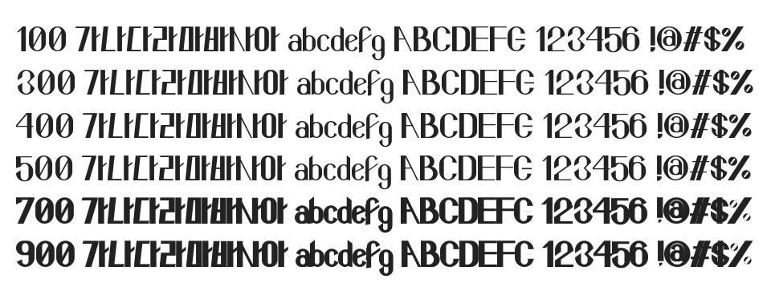

# @noonnu/116watermelon

116수박화체 - 여름에 사이다로 달달한 수박화채를 만들어먹자



## Install

```bash
npm install @noonnu/116watermelon --save
```

### Import the CSS file

```js
import '@noonnu/116watermelon' // esm
// or
require('@noonnu/116watermelon') // cjs
```

#### [css-loader](https://github.com/webpack-contrib/css-loader)

```css
@import url('~@noonnu/116watermelon');
```

## Usage

```css
body {
    font-family: 116watermelon;
}
```

## Link

https://noonnu.cc/font_page/210
