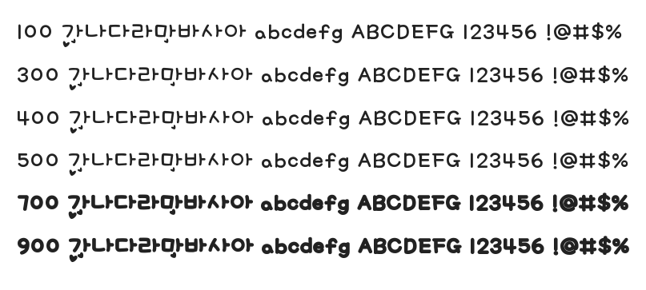

# @noonnu/777-chyaochyureu

챠오츄르 - 고양이는 츄르를 좋아한다



## Install

```bash
npm install @noonnu/777-chyaochyureu --save
```

### Import the CSS file

```js
import '@noonnu/777-chyaochyureu' // esm
// or
require('@noonnu/777-chyaochyureu') // cjs
```

#### [css-loader](https://github.com/webpack-contrib/css-loader)

```css
@import url('~@noonnu/777-chyaochyureu');
```

## Usage

```css
body {
    font-family: 777Chyaochyureu;
}
```

## Link

https://noonnu.cc/font_page/260
