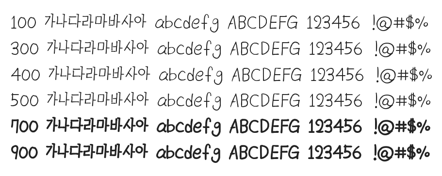

# @noonnu/ac-cchildrensky

ACC 어린이 가을담은체 - 하늘이 맑은날에는 하늘을 보자



## Install

```bash
npm install @noonnu/ac-cchildrensky --save
```

### Import the CSS file

```js
import '@noonnu/ac-cchildrensky' // esm
// or
require('@noonnu/ac-cchildrensky') // cjs
```

#### [css-loader](https://github.com/webpack-contrib/css-loader)

```css
@import url('~@noonnu/ac-cchildrensky');
```

## Usage

```css
body {
    font-family: ACCchildrensky;
}
```

## Link

https://noonnu.cc/font_page/789
