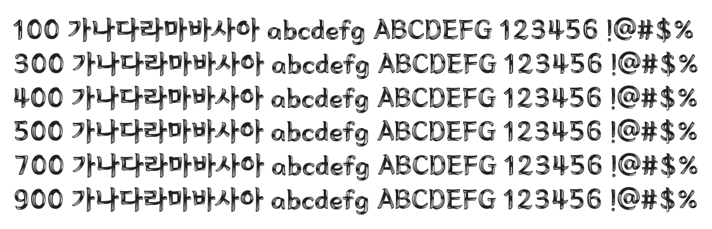

# @noonnu/ansungtangmyun-esg

안성탕면 ESG에코체 - 보글보글 맛있는 라면



## Install

```bash
npm install @noonnu/ansungtangmyun-esg --save
```

### Import the CSS file

```js
import '@noonnu/ansungtangmyun-esg' // esm
// or
require('@noonnu/ansungtangmyun-esg') // cjs
```

#### [css-loader](https://github.com/webpack-contrib/css-loader)

```css
@import url('~@noonnu/ansungtangmyun-esg');
```

## Usage

```css
body {
    font-family: Ansungtangmyun-ESG;
}
```

## Link

https://noonnu.cc/font_page/1046
