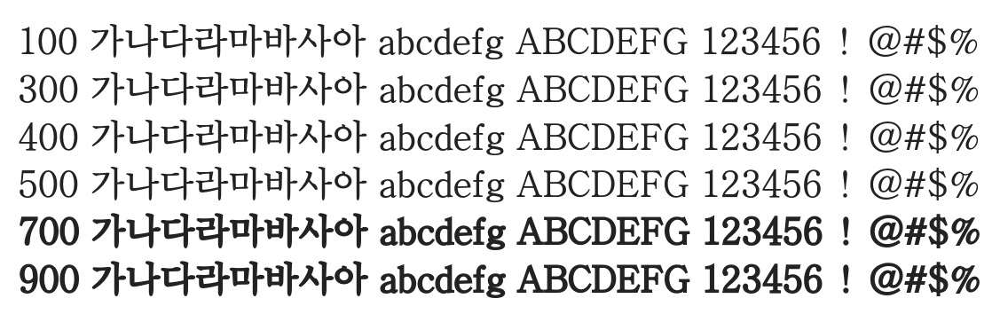

# @noonnu/bareun-batang

바른바탕체 - 무엇이든지 하려고 하면 돈이 드는 법이다



## Install

```bash
npm install @noonnu/bareun-batang --save
```

### Import the CSS file

```js
import '@noonnu/bareun-batang' // esm
// or
require('@noonnu/bareun-batang') // cjs
```

#### [css-loader](https://github.com/webpack-contrib/css-loader)

```css
@import url('~@noonnu/bareun-batang');
```

## Usage

```css
body {
    font-family: BareunBatang;
}
```

## Link

https://noonnu.cc/font_page/30
