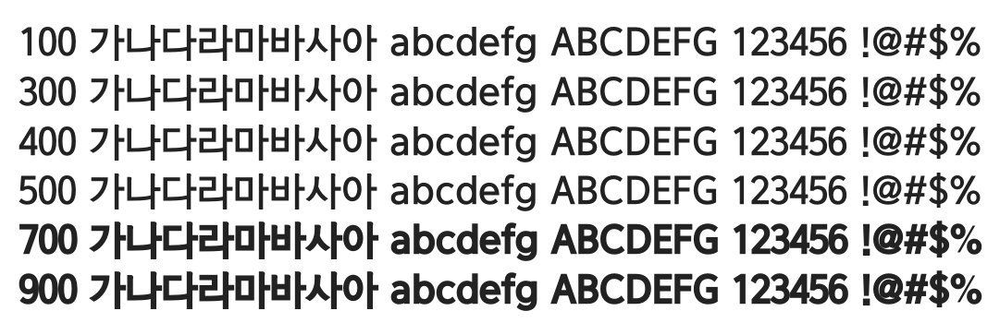

# @noonnu/bareun-dotum

바른돋움체 - 시간은 물 흐르듯 지나간다



## Install

```bash
npm install @noonnu/bareun-dotum --save
```

### Import the CSS file

```js
import '@noonnu/bareun-dotum' // esm
// or
require('@noonnu/bareun-dotum') // cjs
```

#### [css-loader](https://github.com/webpack-contrib/css-loader)

```css
@import url('~@noonnu/bareun-dotum');
```

## Usage

```css
body {
    font-family: BareunDotum;
}
```

## Link

https://noonnu.cc/font_page/31
