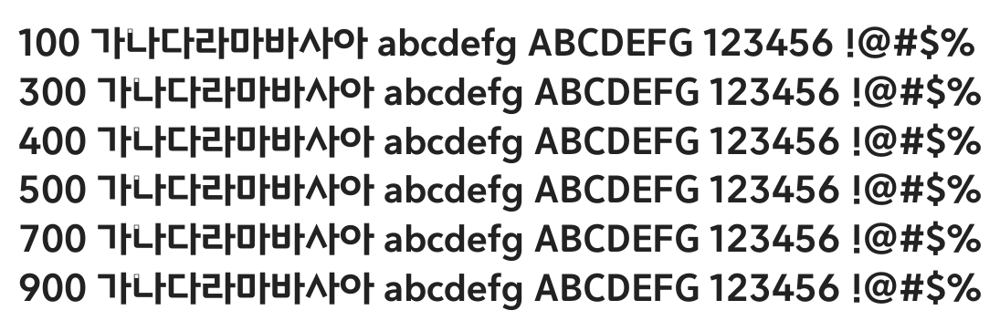

# @noonnu/binggrae-melona-bold

빙그레 메로나체 - 메로나 맛있지



## Install

```bash
npm install @noonnu/binggrae-melona-bold --save
```

### Import the CSS file

```js
import '@noonnu/binggrae-melona-bold' // esm
// or
require('@noonnu/binggrae-melona-bold') // cjs
```

#### [css-loader](https://github.com/webpack-contrib/css-loader)

```css
@import url('~@noonnu/binggrae-melona-bold');
```

## Usage

```css
body {
    font-family: BinggraeMelona-Bold;
}
```

## Link

https://noonnu.cc/font_page/320
