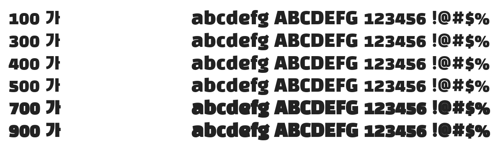

# @noonnu/black-han-sans

검은고딕 - 내 미래는 어떻게 되는 걸까요



## Install

```bash
npm install @noonnu/black-han-sans --save
```

### Import the CSS file

```js
import '@noonnu/black-han-sans' // esm
// or
require('@noonnu/black-han-sans') // cjs
```

#### [css-loader](https://github.com/webpack-contrib/css-loader)

```css
@import url('~@noonnu/black-han-sans');
```

## Usage

```css
body {
    font-family: Black Han Sans;
}
```

## Link

https://noonnu.cc/font_page/106
