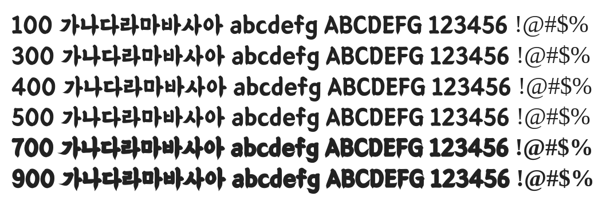

# @noonnu/bmeuljiro

을지로체 - 을지로에서 많이 보이는 글씨체



## Install

```bash
npm install @noonnu/bmeuljiro --save
```

### Import the CSS file

```js
import '@noonnu/bmeuljiro' // esm
// or
require('@noonnu/bmeuljiro') // cjs
```

#### [css-loader](https://github.com/webpack-contrib/css-loader)

```css
@import url('~@noonnu/bmeuljiro');
```

## Usage

```css
body {
    font-family: BMEULJIRO;
}
```

## Link

https://noonnu.cc/font_page/321
