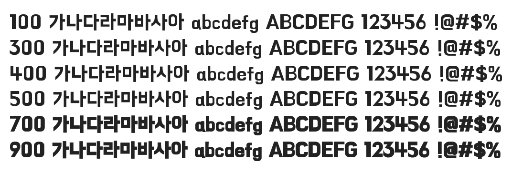

# @noonnu/bmhanna-pro

한나체Pro - 치킨이라고 치면 칰이 나온대



## Install

```bash
npm install @noonnu/bmhanna-pro --save
```

### Import the CSS file

```js
import '@noonnu/bmhanna-pro' // esm
// or
require('@noonnu/bmhanna-pro') // cjs
```

#### [css-loader](https://github.com/webpack-contrib/css-loader)

```css
@import url('~@noonnu/bmhanna-pro');
```

## Usage

```css
body {
    font-family: BMHANNAPro;
}
```

## Link

https://noonnu.cc/font_page/216
