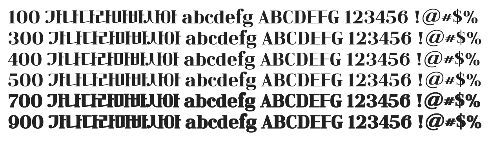

# @noonnu/cafe24-classic-type-regular

카페24 클래식타입 - 나는 역시 멋있어 최고야



## Install

```bash
npm install @noonnu/cafe24-classic-type-regular --save
```

### Import the CSS file

```js
import '@noonnu/cafe24-classic-type-regular' // esm
// or
require('@noonnu/cafe24-classic-type-regular') // cjs
```

#### [css-loader](https://github.com/webpack-contrib/css-loader)

```css
@import url('~@noonnu/cafe24-classic-type-regular');
```

## Usage

```css
body {
    font-family: Cafe24ClassicType-Regular;
}
```

## Link

https://noonnu.cc/font_page/1035
