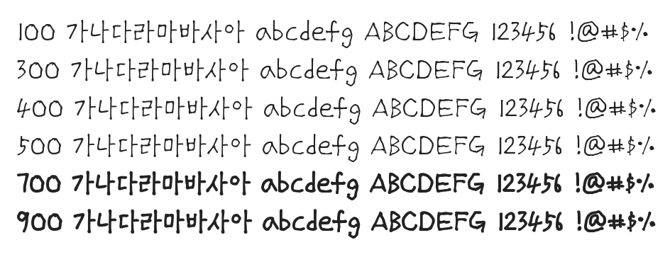

# @noonnu/chilgok-kaj

칠곡할매 권안자체 - 성인문해교육으로 한글을 배우신 어르신의 글씨



## Install

```bash
npm install @noonnu/chilgok-kaj --save
```

### Import the CSS file

```js
import '@noonnu/chilgok-kaj' // esm
// or
require('@noonnu/chilgok-kaj') // cjs
```

#### [css-loader](https://github.com/webpack-contrib/css-loader)

```css
@import url('~@noonnu/chilgok-kaj');
```

## Usage

```css
body {
    font-family: Chilgok_Kaj;
}
```

## Link

https://noonnu.cc/font_page/682
