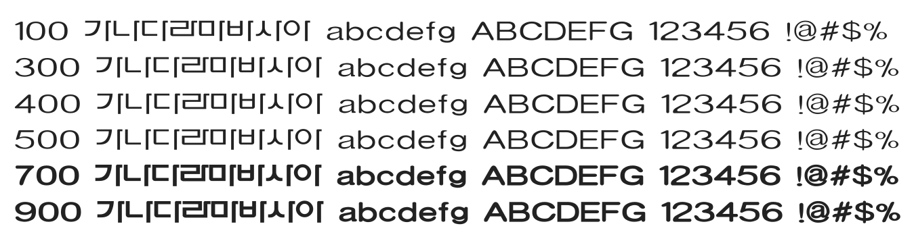

# @noonnu/chonbukl

전라북도체 - 넌 머지않아 예쁜 꽃이 될거니까



## Install

```bash
npm install @noonnu/chonbukl --save
```

### Import the CSS file

```js
import '@noonnu/chonbukl' // esm
// or
require('@noonnu/chonbukl') // cjs
```

#### [css-loader](https://github.com/webpack-contrib/css-loader)

```css
@import url('~@noonnu/chonbukl');
```

## Usage

```css
body {
    font-family: CHONBUKL;
}
```

## Link

https://noonnu.cc/font_page/57
