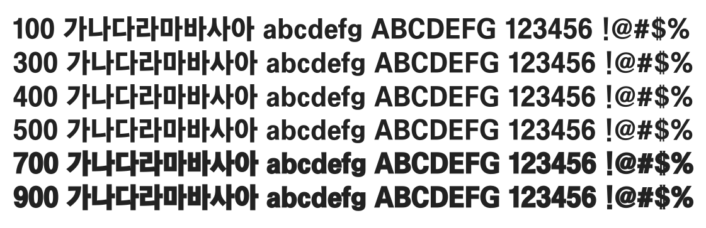

# @noonnu/chosun-bg

조선견고딕 - 견고해보이는 견고딕



## Install

```bash
npm install @noonnu/chosun-bg --save
```

### Import the CSS file

```js
import '@noonnu/chosun-bg' // esm
// or
require('@noonnu/chosun-bg') // cjs
```

#### [css-loader](https://github.com/webpack-contrib/css-loader)

```css
@import url('~@noonnu/chosun-bg');
```

## Usage

```css
body {
    font-family: ChosunBg;
}
```

## Link

https://noonnu.cc/font_page/414
