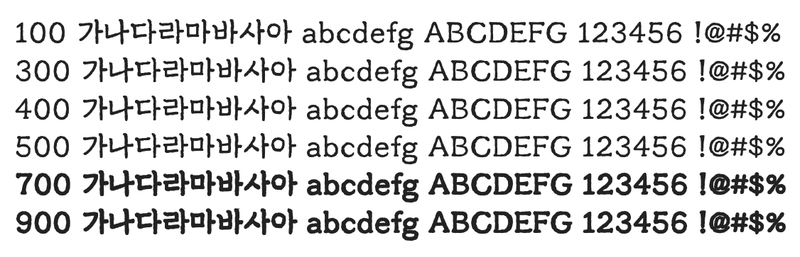

# @noonnu/chosun-centennial

조선100년체 - 1920년대 지면의 글꼴



## Install

```bash
npm install @noonnu/chosun-centennial --save
```

### Import the CSS file

```js
import '@noonnu/chosun-centennial' // esm
// or
require('@noonnu/chosun-centennial') // cjs
```

#### [css-loader](https://github.com/webpack-contrib/css-loader)

```css
@import url('~@noonnu/chosun-centennial');
```

## Usage

```css
body {
    font-family: ChosunCentennial;
}
```

## Link

https://noonnu.cc/font_page/937
