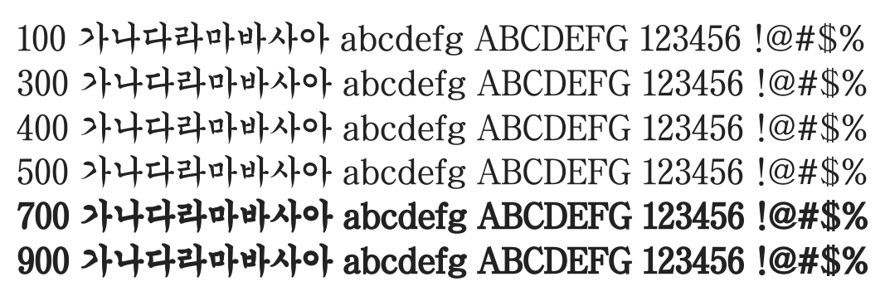

# @noonnu/chosun-gs

조선궁서체 - 진지하니까 궁서체로 말한다.



## Install

```bash
npm install @noonnu/chosun-gs --save
```

### Import the CSS file

```js
import '@noonnu/chosun-gs' // esm
// or
require('@noonnu/chosun-gs') // cjs
```

#### [css-loader](https://github.com/webpack-contrib/css-loader)

```css
@import url('~@noonnu/chosun-gs');
```

## Usage

```css
body {
    font-family: ChosunGs;
}
```

## Link

https://noonnu.cc/font_page/416
