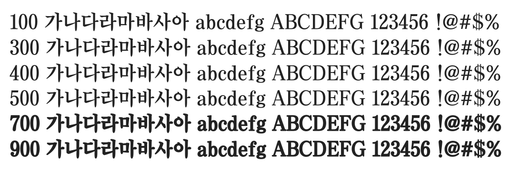

# @noonnu/chosun-km

조선굵은명조 - 아무것도 안하고 싶다



## Install

```bash
npm install @noonnu/chosun-km --save
```

### Import the CSS file

```js
import '@noonnu/chosun-km' // esm
// or
require('@noonnu/chosun-km') // cjs
```

#### [css-loader](https://github.com/webpack-contrib/css-loader)

```css
@import url('~@noonnu/chosun-km');
```

## Usage

```css
body {
    font-family: ChosunKm;
}
```

## Link

https://noonnu.cc/font_page/411
