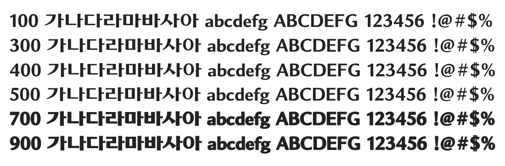

# @noonnu/chosun-lo

조선로고체 - 이걸로 조선일보쓰면 조선일보 로고



## Install

```bash
npm install @noonnu/chosun-lo --save
```

### Import the CSS file

```js
import '@noonnu/chosun-lo' // esm
// or
require('@noonnu/chosun-lo') // cjs
```

#### [css-loader](https://github.com/webpack-contrib/css-loader)

```css
@import url('~@noonnu/chosun-lo');
```

## Usage

```css
body {
    font-family: ChosunLo;
}
```

## Link

https://noonnu.cc/font_page/417
