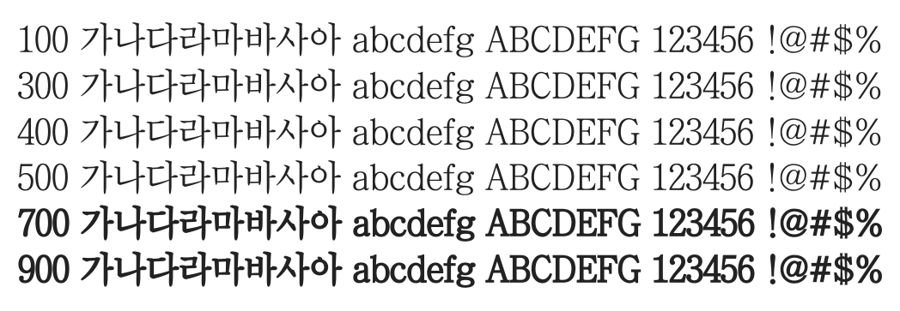

# @noonnu/chosun-sm

조선신명조 - 조선일보 창간 100주년 기념 폰트



## Install

```bash
npm install @noonnu/chosun-sm --save
```

### Import the CSS file

```js
import '@noonnu/chosun-sm' // esm
// or
require('@noonnu/chosun-sm') // cjs
```

#### [css-loader](https://github.com/webpack-contrib/css-loader)

```css
@import url('~@noonnu/chosun-sm');
```

## Usage

```css
body {
    font-family: ChosunSm;
}
```

## Link

https://noonnu.cc/font_page/418
