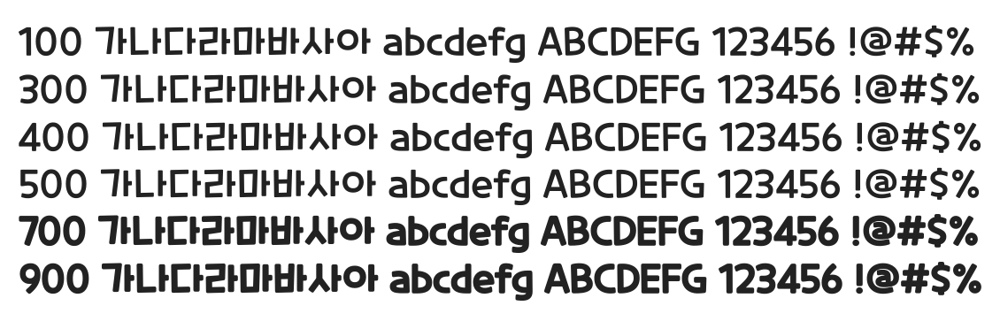

# @noonnu/cookie-run-regular

쿠키런 - 오 쿠키런 폰트 Regular도 나왔다



## Install

```bash
npm install @noonnu/cookie-run-regular --save
```

### Import the CSS file

```js
import '@noonnu/cookie-run-regular' // esm
// or
require('@noonnu/cookie-run-regular') // cjs
```

#### [css-loader](https://github.com/webpack-contrib/css-loader)

```css
@import url('~@noonnu/cookie-run-regular');
```

## Usage

```css
body {
    font-family: CookieRun-Regular;
}
```

## Link

https://noonnu.cc/font_page/364
