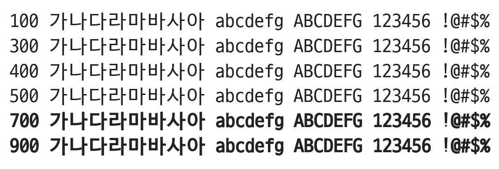

# @noonnu/d2-coding

D2Coding - $(window).scroll(function(){ });



## Install

```bash
npm install @noonnu/d2-coding --save
```

### Import the CSS file

```js
import '@noonnu/d2-coding' // esm
// or
require('@noonnu/d2-coding') // cjs
```

#### [css-loader](https://github.com/webpack-contrib/css-loader)

```css
@import url('~@noonnu/d2-coding');
```

## Usage

```css
body {
    font-family: D2Coding;
}
```

## Link

https://noonnu.cc/font_page/92
