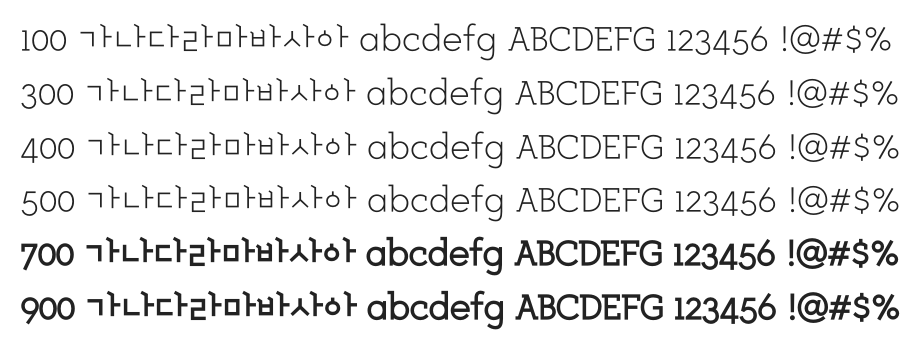

# @noonnu/designhouse-otf-light00

디자인하우스체 - 디자인 잘하고 싶다



## Install

```bash
npm install @noonnu/designhouse-otf-light00 --save
```

### Import the CSS file

```js
import '@noonnu/designhouse-otf-light00' // esm
// or
require('@noonnu/designhouse-otf-light00') // cjs
```

#### [css-loader](https://github.com/webpack-contrib/css-loader)

```css
@import url('~@noonnu/designhouse-otf-light00');
```

## Usage

```css
body {
    font-family: designhouseOTFLight00;
}
```

## Link

https://noonnu.cc/font_page/89
