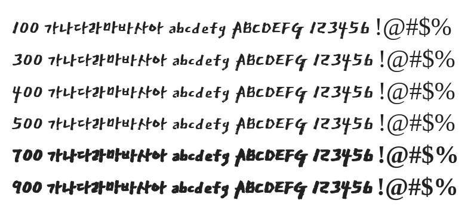

# @noonnu/dokdo

대한민국 독도체 - 대한민국의 영토는 한반도와 그 부속도서로 한다



## Install

```bash
npm install @noonnu/dokdo --save
```

### Import the CSS file

```js
import '@noonnu/dokdo' // esm
// or
require('@noonnu/dokdo') // cjs
```

#### [css-loader](https://github.com/webpack-contrib/css-loader)

```css
@import url('~@noonnu/dokdo');
```

## Usage

```css
body {
    font-family: Dokdo;
}
```

## Link

https://noonnu.cc/font_page/110
