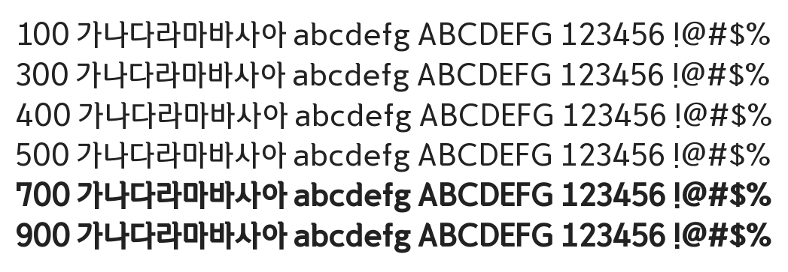

# @noonnu/dolbomche-r

문화재돌봄체 - 문화재청은 문화재를 돌봅니다



## Install

```bash
npm install @noonnu/dolbomche-r --save
```

### Import the CSS file

```js
import '@noonnu/dolbomche-r' // esm
// or
require('@noonnu/dolbomche-r') // cjs
```

#### [css-loader](https://github.com/webpack-contrib/css-loader)

```css
@import url('~@noonnu/dolbomche-r');
```

## Usage

```css
body {
    font-family: Dolbomche_R;
}
```

## Link

https://noonnu.cc/font_page/653
