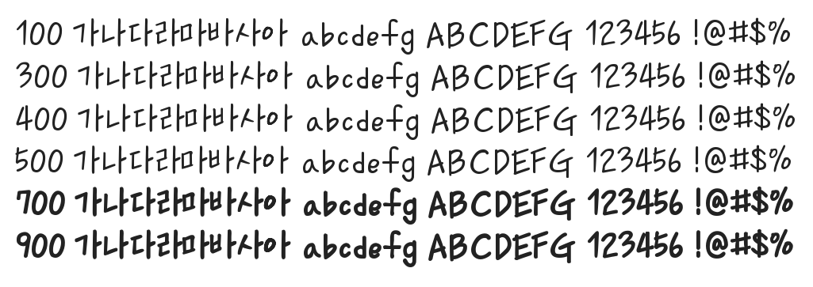

# @noonnu/donoun-medium

두넌체 - 이 폰트를 쓰면 디자이너가 좋아할겁니다



## Install

```bash
npm install @noonnu/donoun-medium --save
```

### Import the CSS file

```js
import '@noonnu/donoun-medium' // esm
// or
require('@noonnu/donoun-medium') // cjs
```

#### [css-loader](https://github.com/webpack-contrib/css-loader)

```css
@import url('~@noonnu/donoun-medium');
```

## Usage

```css
body {
    font-family: Donoun-Medium;
}
```

## Link

https://noonnu.cc/font_page/887
