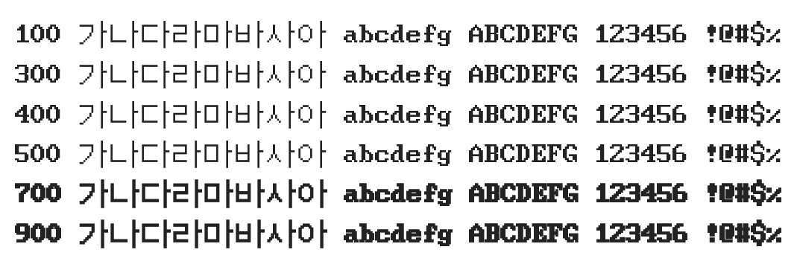

# @noonnu/dos-gothic

도스고딕 - 뭔가 팩맨이라도 해야할것 같아



## Install

```bash
npm install @noonnu/dos-gothic --save
```

### Import the CSS file

```js
import '@noonnu/dos-gothic' // esm
// or
require('@noonnu/dos-gothic') // cjs
```

#### [css-loader](https://github.com/webpack-contrib/css-loader)

```css
@import url('~@noonnu/dos-gothic');
```

## Usage

```css
body {
    font-family: DOSGothic;
}
```

## Link

https://noonnu.cc/font_page/239
