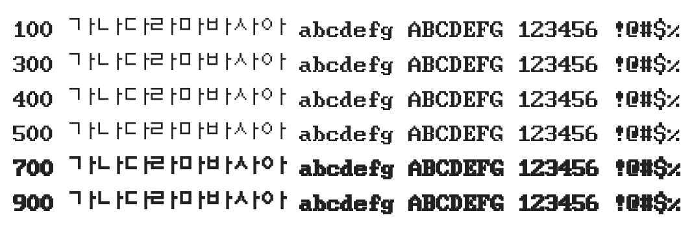

# @noonnu/dos-saemmul

도스샘물 - 다람쥐 헌 쳇바퀴에 데굴데굴



## Install

```bash
npm install @noonnu/dos-saemmul --save
```

### Import the CSS file

```js
import '@noonnu/dos-saemmul' // esm
// or
require('@noonnu/dos-saemmul') // cjs
```

#### [css-loader](https://github.com/webpack-contrib/css-loader)

```css
@import url('~@noonnu/dos-saemmul');
```

## Usage

```css
body {
    font-family: DOSSaemmul;
}
```

## Link

https://noonnu.cc/font_page/240
