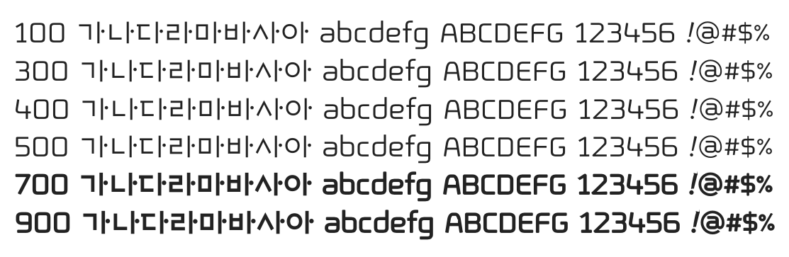

# @noonnu/ebs-hunminjeongeum-sba

EBS훈민정음 - 훈민정음을 만드는 건 어려웠을거야



## Install

```bash
npm install @noonnu/ebs-hunminjeongeum-sba --save
```

### Import the CSS file

```js
import '@noonnu/ebs-hunminjeongeum-sba' // esm
// or
require('@noonnu/ebs-hunminjeongeum-sba') // cjs
```

#### [css-loader](https://github.com/webpack-contrib/css-loader)

```css
@import url('~@noonnu/ebs-hunminjeongeum-sba');
```

## Usage

```css
body {
    font-family: EBSHunminjeongeumSBA;
}
```

## Link

https://noonnu.cc/font_page/76
