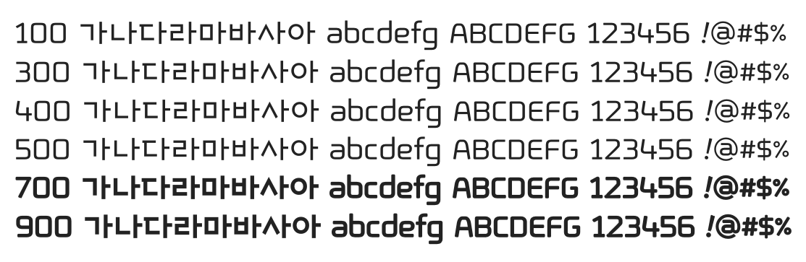

# @noonnu/ebshmje-saeron-ra

EBS훈민정음새론체 - 새론은 새로운이라는 뜻이야



## Install

```bash
npm install @noonnu/ebshmje-saeron-ra --save
```

### Import the CSS file

```js
import '@noonnu/ebshmje-saeron-ra' // esm
// or
require('@noonnu/ebshmje-saeron-ra') // cjs
```

#### [css-loader](https://github.com/webpack-contrib/css-loader)

```css
@import url('~@noonnu/ebshmje-saeron-ra');
```

## Usage

```css
body {
    font-family: EBSHMJESaeronRA;
}
```

## Link

https://noonnu.cc/font_page/77
