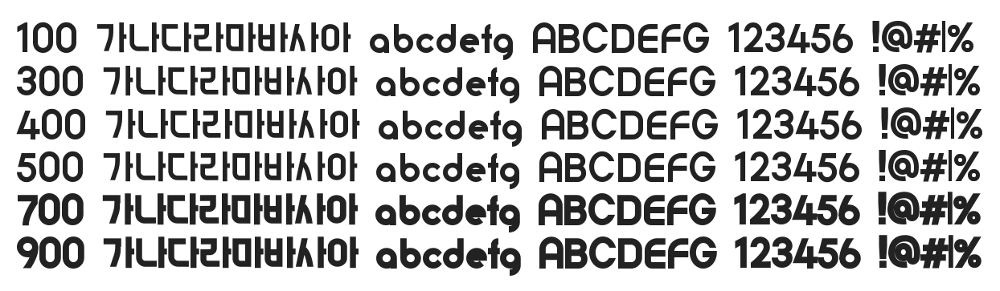

# @noonnu/ef-ladio

라디오고딕 - 조경작업장 예쁘고 신기하다



## Install

```bash
npm install @noonnu/ef-ladio --save
```

### Import the CSS file

```js
import '@noonnu/ef-ladio' // esm
// or
require('@noonnu/ef-ladio') // cjs
```

#### [css-loader](https://github.com/webpack-contrib/css-loader)

```css
@import url('~@noonnu/ef-ladio');
```

## Usage

```css
body {
    font-family: EF_ladio;
}
```

## Link

https://noonnu.cc/font_page/927
