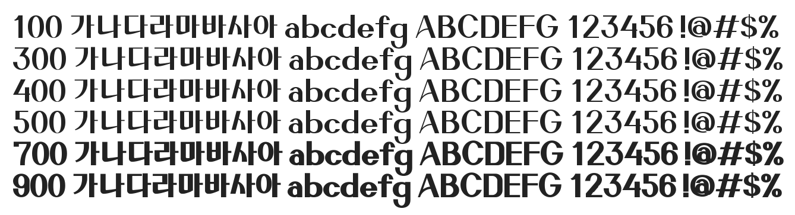

# @noonnu/ef-rebecca

레베카체 - 커튼같이 고급져보이는 폰트



## Install

```bash
npm install @noonnu/ef-rebecca --save
```

### Import the CSS file

```js
import '@noonnu/ef-rebecca' // esm
// or
require('@noonnu/ef-rebecca') // cjs
```

#### [css-loader](https://github.com/webpack-contrib/css-loader)

```css
@import url('~@noonnu/ef-rebecca');
```

## Usage

```css
body {
    font-family: EF_Rebecca;
}
```

## Link

https://noonnu.cc/font_page/1033
