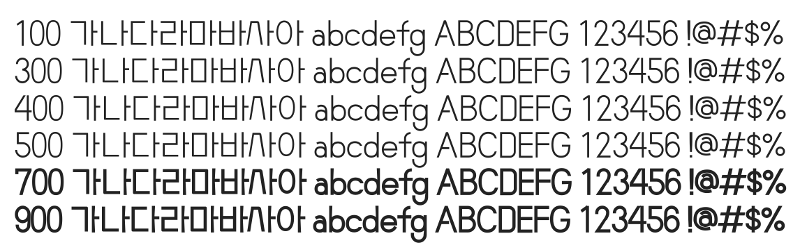

# @noonnu/ef-watermelon-salad

수박화체 - 시옷이 귀여운 수박화체 폰트



## Install

```bash
npm install @noonnu/ef-watermelon-salad --save
```

### Import the CSS file

```js
import '@noonnu/ef-watermelon-salad' // esm
// or
require('@noonnu/ef-watermelon-salad') // cjs
```

#### [css-loader](https://github.com/webpack-contrib/css-loader)

```css
@import url('~@noonnu/ef-watermelon-salad');
```

## Usage

```css
body {
    font-family: EF_watermelonSalad;
}
```

## Link

https://noonnu.cc/font_page/1034
