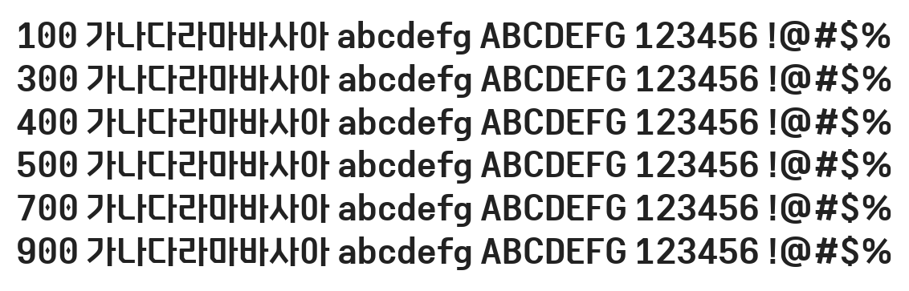

# @noonnu/elice-digital-baeum-bold

엘리스 디지털코딩체 - puts "Hello #{@name}!"



## Install

```bash
npm install @noonnu/elice-digital-baeum-bold --save
```

### Import the CSS file

```js
import '@noonnu/elice-digital-baeum-bold' // esm
// or
require('@noonnu/elice-digital-baeum-bold') // cjs
```

#### [css-loader](https://github.com/webpack-contrib/css-loader)

```css
@import url('~@noonnu/elice-digital-baeum-bold');
```

## Usage

```css
body {
    font-family: EliceDigitalBaeum_Bold;
}
```

## Link

https://noonnu.cc/font_page/920
