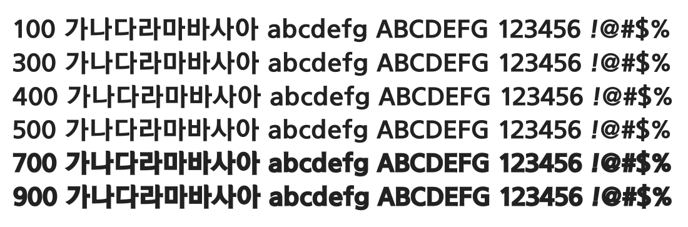

# @noonnu/eoe-zno-eb

남양주고딕 - 뉸뱃지 좀 사주세요.. 아직도 많이 남았어



## Install

```bash
npm install @noonnu/eoe-zno-eb --save
```

### Import the CSS file

```js
import '@noonnu/eoe-zno-eb' // esm
// or
require('@noonnu/eoe-zno-eb') // cjs
```

#### [css-loader](https://github.com/webpack-contrib/css-loader)

```css
@import url('~@noonnu/eoe-zno-eb');
```

## Usage

```css
body {
    font-family: Eoe_Zno_EB;
}
```

## Link

https://noonnu.cc/font_page/294
