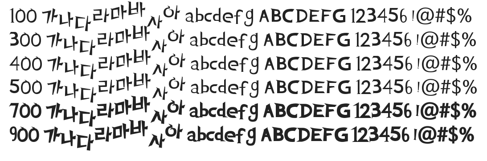

# @noonnu/establish-thorn-font-otf

가시가시체 백민주 - 뾰족뾰족한 글씨체



## Install

```bash
npm install @noonnu/establish-thorn-font-otf --save
```

### Import the CSS file

```js
import '@noonnu/establish-thorn-font-otf' // esm
// or
require('@noonnu/establish-thorn-font-otf') // cjs
```

#### [css-loader](https://github.com/webpack-contrib/css-loader)

```css
@import url('~@noonnu/establish-thorn-font-otf');
```

## Usage

```css
body {
    font-family: establishThornFontOTF;
}
```

## Link

https://noonnu.cc/font_page/778
