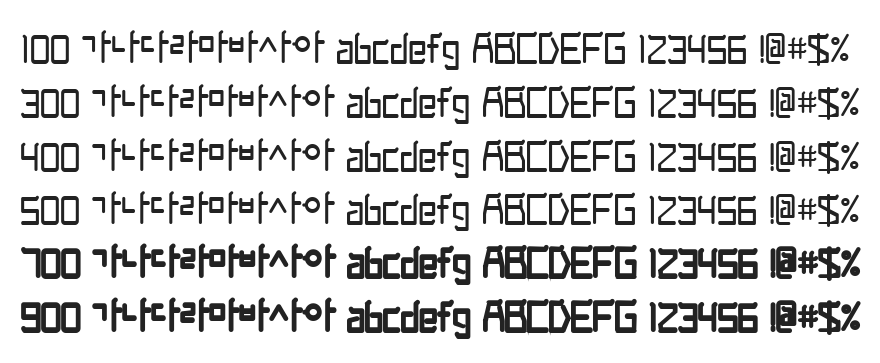

# @noonnu/foureyes

안경잡이체 - 별을 보고 걸어가는 사람이 되라



## Install

```bash
npm install @noonnu/foureyes --save
```

### Import the CSS file

```js
import '@noonnu/foureyes' // esm
// or
require('@noonnu/foureyes') // cjs
```

#### [css-loader](https://github.com/webpack-contrib/css-loader)

```css
@import url('~@noonnu/foureyes');
```

## Usage

```css
body {
    font-family: FOUREYES;
}
```

## Link

https://noonnu.cc/font_page/83
