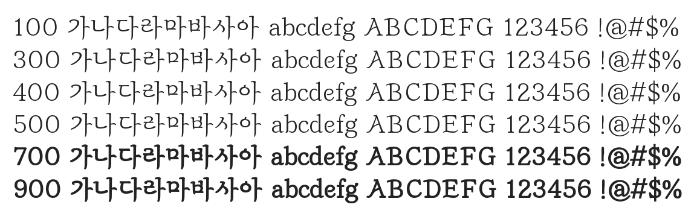

# @noonnu/gabia-maeumgyeol

가비아 마음결체 - 너가 행복하면 된거지 그게 중요해



## Install

```bash
npm install @noonnu/gabia-maeumgyeol --save
```

### Import the CSS file

```js
import '@noonnu/gabia-maeumgyeol' // esm
// or
require('@noonnu/gabia-maeumgyeol') // cjs
```

#### [css-loader](https://github.com/webpack-contrib/css-loader)

```css
@import url('~@noonnu/gabia-maeumgyeol');
```

## Usage

```css
body {
    font-family: GabiaMaeumgyeol;
}
```

## Link

https://noonnu.cc/font_page/889
