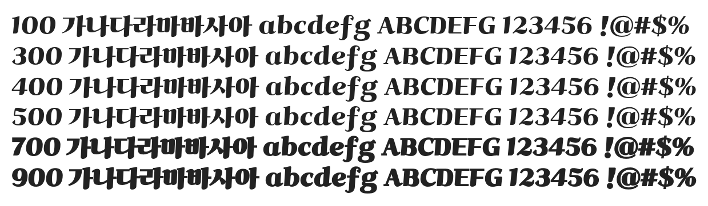

# @noonnu/ghanachoco

가나초콜릿체 - 부드러움 한 조각, 가나 초콜릿



## Install

```bash
npm install @noonnu/ghanachoco --save
```

### Import the CSS file

```js
import '@noonnu/ghanachoco' // esm
// or
require('@noonnu/ghanachoco') // cjs
```

#### [css-loader](https://github.com/webpack-contrib/css-loader)

```css
@import url('~@noonnu/ghanachoco');
```

## Usage

```css
body {
    font-family: ghanachoco;
}
```

## Link

https://noonnu.cc/font_page/408
