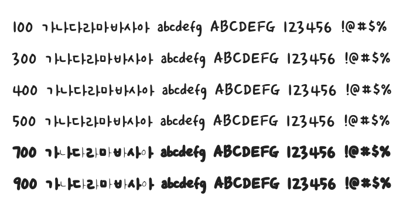

# @noonnu/godo-maum

고도마음체 - 구겨진 종이가 멀리 날아간다.



## Install

```bash
npm install @noonnu/godo-maum --save
```

### Import the CSS file

```js
import '@noonnu/godo-maum' // esm
// or
require('@noonnu/godo-maum') // cjs
```

#### [css-loader](https://github.com/webpack-contrib/css-loader)

```css
@import url('~@noonnu/godo-maum');
```

## Usage

```css
body {
    font-family: godoMaum;
}
```

## Link

https://noonnu.cc/font_page/2
