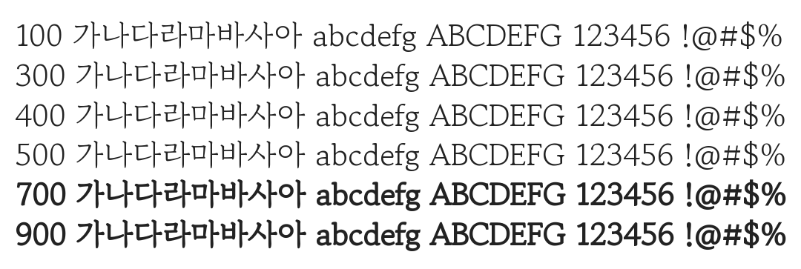

# @noonnu/gowun-batang-regular

고운바탕 - 단정하고 고운 글씨체



## Install

```bash
npm install @noonnu/gowun-batang-regular --save
```

### Import the CSS file

```js
import '@noonnu/gowun-batang-regular' // esm
// or
require('@noonnu/gowun-batang-regular') // cjs
```

#### [css-loader](https://github.com/webpack-contrib/css-loader)

```css
@import url('~@noonnu/gowun-batang-regular');
```

## Usage

```css
body {
    font-family: GowunBatang-Regular;
}
```

## Link

https://noonnu.cc/font_page/733
