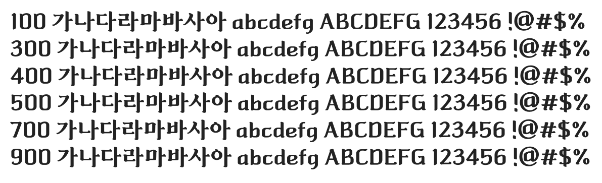

# @noonnu/gukripbakmulgwanmunhwajaedankeulraesik-b

박물관문화재단클래식 - 고풍스러운 글씨체



## Install

```bash
npm install @noonnu/gukripbakmulgwanmunhwajaedankeulraesik-b --save
```

### Import the CSS file

```js
import '@noonnu/gukripbakmulgwanmunhwajaedankeulraesik-b' // esm
// or
require('@noonnu/gukripbakmulgwanmunhwajaedankeulraesik-b') // cjs
```

#### [css-loader](https://github.com/webpack-contrib/css-loader)

```css
@import url('~@noonnu/gukripbakmulgwanmunhwajaedankeulraesik-b');
```

## Usage

```css
body {
    font-family: 국립박물관문화재단클래식B;
}
```

## Link

https://noonnu.cc/font_page/326
