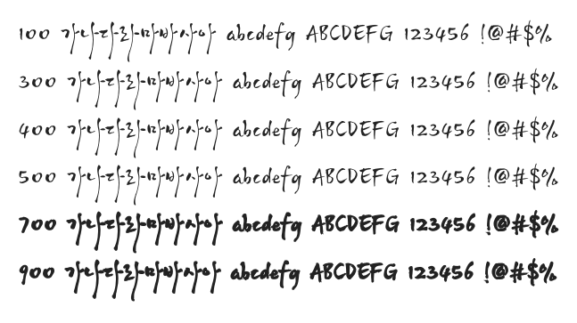

# @noonnu/haengbokgoheung-l

행복고흥 - 지붕없는 미술관 고흥



## Install

```bash
npm install @noonnu/haengbokgoheung-l --save
```

### Import the CSS file

```js
import '@noonnu/haengbokgoheung-l' // esm
// or
require('@noonnu/haengbokgoheung-l') // cjs
```

#### [css-loader](https://github.com/webpack-contrib/css-loader)

```css
@import url('~@noonnu/haengbokgoheung-l');
```

## Usage

```css
body {
    font-family: 행복고흥L;
}
```

## Link

https://noonnu.cc/font_page/331
