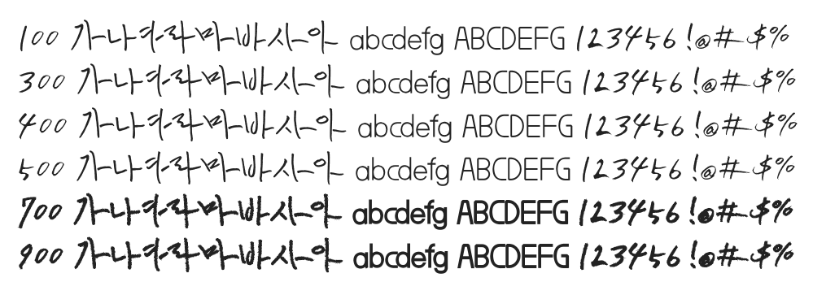

# @noonnu/han-yong-un

한용운체 - 독립운동가의 글씨체를 내 손으로



## Install

```bash
npm install @noonnu/han-yong-un --save
```

### Import the CSS file

```js
import '@noonnu/han-yong-un' // esm
// or
require('@noonnu/han-yong-un') // cjs
```

#### [css-loader](https://github.com/webpack-contrib/css-loader)

```css
@import url('~@noonnu/han-yong-un');
```

## Usage

```css
body {
    font-family: HAN-YONG-UN;
}
```

## Link

https://noonnu.cc/font_page/368
