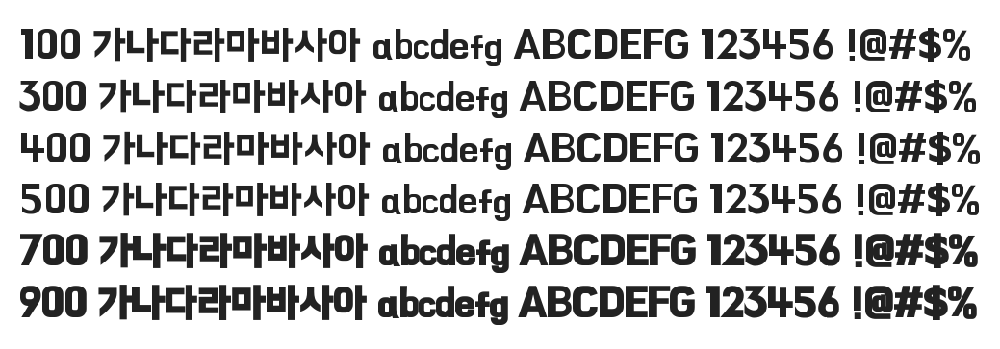

# @noonnu/hanna

한나체 - 우아한형제들의 폰트가 적용되어 있습니다.



## Install

```bash
npm install @noonnu/hanna --save
```

### Import the CSS file

```js
import '@noonnu/hanna' // esm
// or
require('@noonnu/hanna') // cjs
```

#### [css-loader](https://github.com/webpack-contrib/css-loader)

```css
@import url('~@noonnu/hanna');
```

## Usage

```css
body {
    font-family: Hanna;
}
```

## Link

https://noonnu.cc/font_page/52
