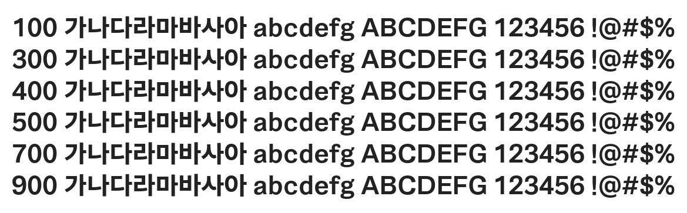

# @noonnu/happiness-sans-title

해피니스 산스 Title - 제주도에서 유채꽃밭을 보고 싶어



## Install

```bash
npm install @noonnu/happiness-sans-title --save
```

### Import the CSS file

```js
import '@noonnu/happiness-sans-title' // esm
// or
require('@noonnu/happiness-sans-title') // cjs
```

#### [css-loader](https://github.com/webpack-contrib/css-loader)

```css
@import url('~@noonnu/happiness-sans-title');
```

## Usage

```css
body {
    font-family: Happiness-Sans-Title;
}
```

## Link

https://noonnu.cc/font_page/902
