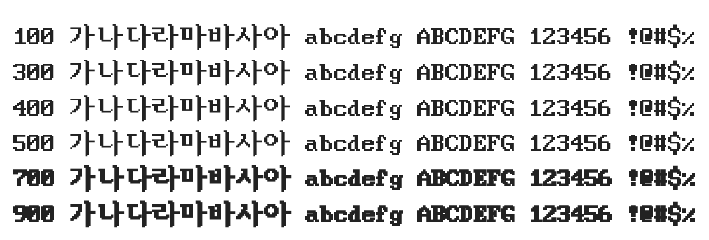

# @noonnu/hbios-sys

HBIOS-SYS - 내 취향을 알면 휘둘리지 않아



## Install

```bash
npm install @noonnu/hbios-sys --save
```

### Import the CSS file

```js
import '@noonnu/hbios-sys' // esm
// or
require('@noonnu/hbios-sys') // cjs
```

#### [css-loader](https://github.com/webpack-contrib/css-loader)

```css
@import url('~@noonnu/hbios-sys');
```

## Usage

```css
body {
    font-family: HBIOS-SYS;
}
```

## Link

https://noonnu.cc/font_page/960
