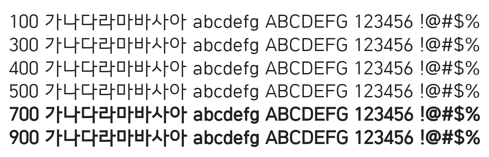

# @noonnu/hcr-dotum

함초롬체 - 점심먹고 나면 나른하고 졸립고 그래



## Install

```bash
npm install @noonnu/hcr-dotum --save
```

### Import the CSS file

```js
import '@noonnu/hcr-dotum' // esm
// or
require('@noonnu/hcr-dotum') // cjs
```

#### [css-loader](https://github.com/webpack-contrib/css-loader)

```css
@import url('~@noonnu/hcr-dotum');
```

## Usage

```css
body {
    font-family: HCRDotum;
}
```

## Link

https://noonnu.cc/font_page/123
