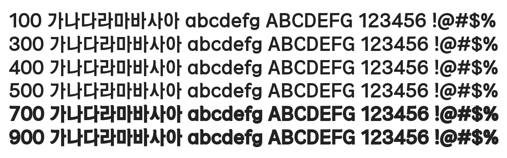

# @noonnu/hoengseong-hanu

횡성한우체 - 유자청으로 에이드를 만들어 마시니 맛있다



## Install

```bash
npm install @noonnu/hoengseong-hanu --save
```

### Import the CSS file

```js
import '@noonnu/hoengseong-hanu' // esm
// or
require('@noonnu/hoengseong-hanu') // cjs
```

#### [css-loader](https://github.com/webpack-contrib/css-loader)

```css
@import url('~@noonnu/hoengseong-hanu');
```

## Usage

```css
body {
    font-family: HoengseongHanu;
}
```

## Link

https://noonnu.cc/font_page/854
