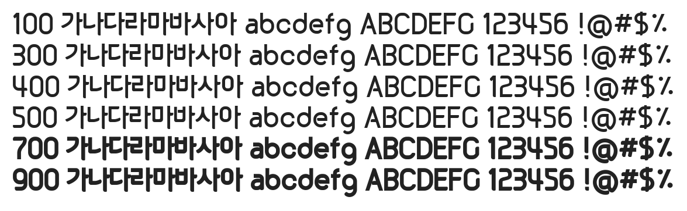

# @noonnu/hs-gaeul-senggak20

HS가을생각체2.0 - 가을단풍구경 하고 싶다



## Install

```bash
npm install @noonnu/hs-gaeul-senggak20 --save
```

### Import the CSS file

```js
import '@noonnu/hs-gaeul-senggak20' // esm
// or
require('@noonnu/hs-gaeul-senggak20') // cjs
```

#### [css-loader](https://github.com/webpack-contrib/css-loader)

```css
@import url('~@noonnu/hs-gaeul-senggak20');
```

## Usage

```css
body {
    font-family: HSGaeulSenggak20;
}
```

## Link

https://noonnu.cc/font_page/735
